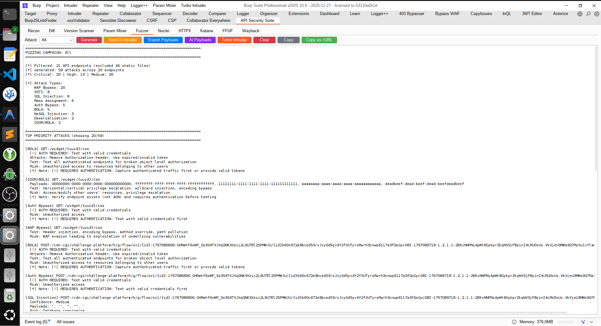
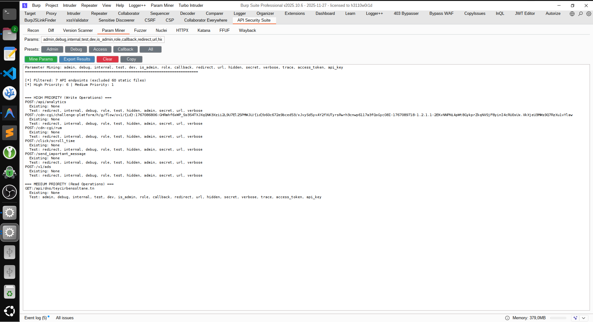
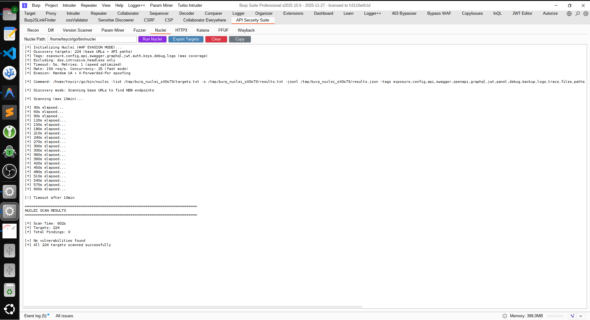
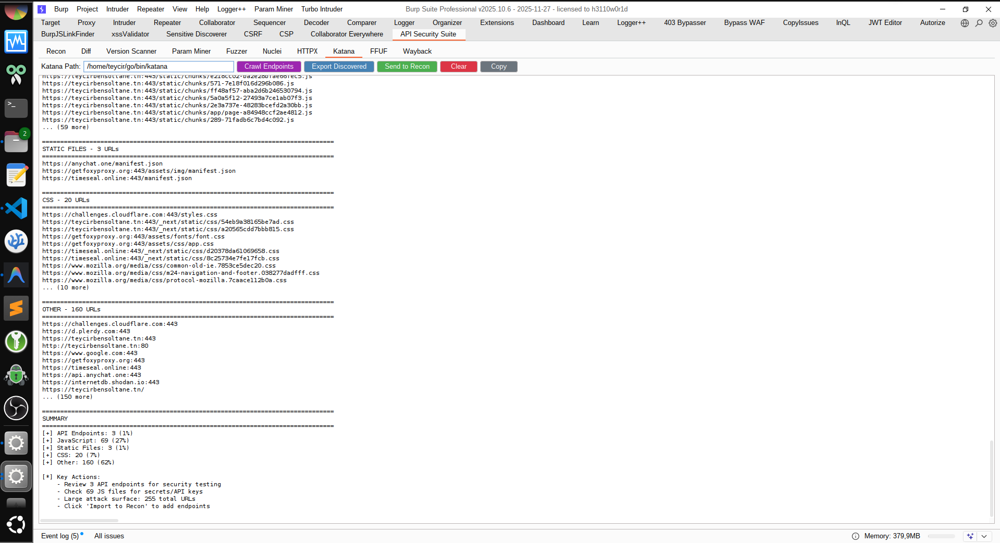
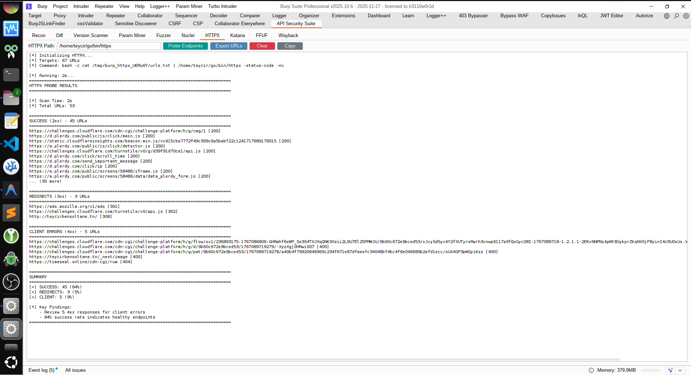
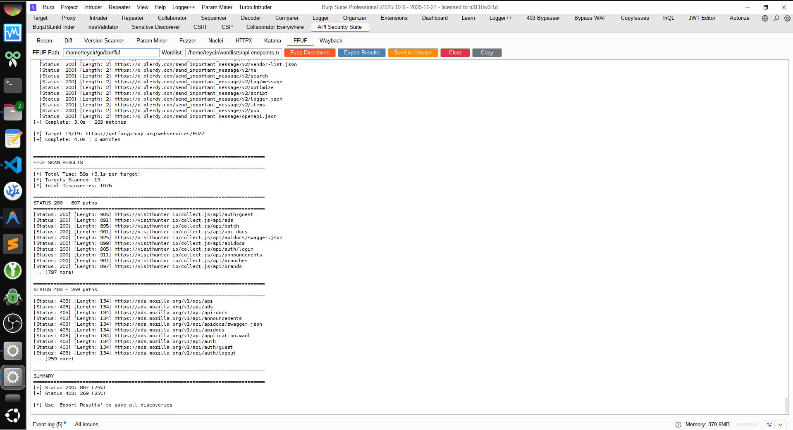
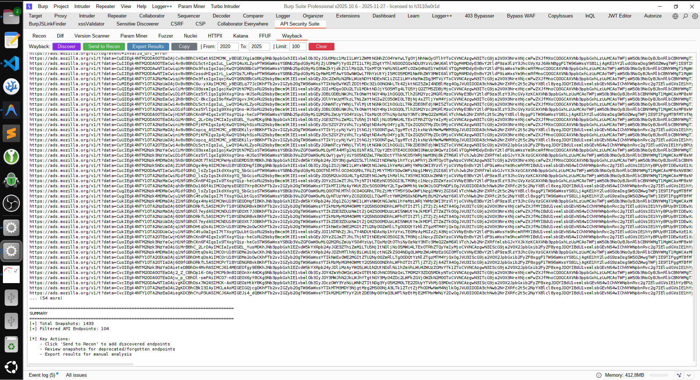
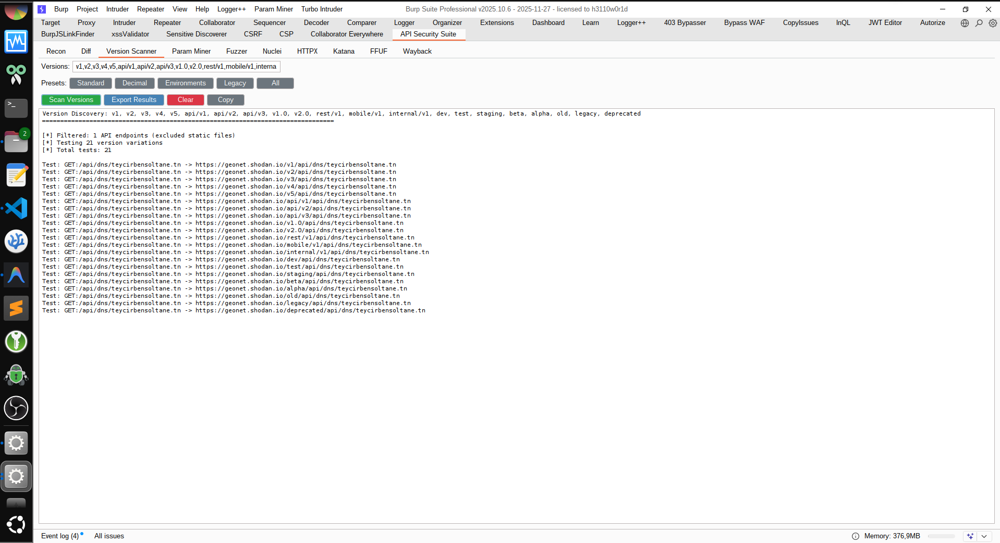

# BurpAPISecuritySuite

<p align="center">
  
</p>

<p align="center">
  
</p>


Professional-grade Burp Suite extension for comprehensive API reconnaissance, intelligent fuzzing, and AI-powered security testing.

## Table of Contents

- [Screenshots](#screenshots)
- [Purpose](#purpose)
- [Key Features](#key-features)
- [Comparison with Similar Tools](#comparison-with-similar-tools)
- [Installation](#installation)
- [Requirements](#requirements)
- [Usage](#usage)
  - [Basic Workflow](#basic-workflow)
  - [Tab Overview](#tab-overview)
- [Advanced Fuzzing Capabilities](#advanced-fuzzing-capabilities)
  - [Attack Types Detected](#attack-types-detected)
- [Workflow Examples](#workflow-examples)
- [Data & Export](#data--export)
  - [What Gets Captured](#what-gets-captured)
  - [Exported Data Structure](#exported-data-structure)
  - [Output Locations](#output-locations)
- [Integration](#integration)
  - [LLM Prompt Integration](#llm-prompt-integration)
  - [Best Practices](#best-practices)
- [Technical Information](#technical-information)
  - [Technical Details](#technical-details)
  - [Technical Highlights](#technical-highlights)
  - [Limitations](#limitations)
- [Use Cases](#use-cases)
- [Documentation](#documentation)
- [FAQ](#faq)
- [Related Projects](#related-projects)
- [Contributing](#contributing)
  - [Author](#author)
  - [License](#license)
- [Updates & Roadmap](#updates--roadmap)
  - [Recent Updates](#recent-updates)
  - [Roadmap](#roadmap)

## Screenshots

### Main Interface


### Fuzzer Tab


### Parameter Analysis


### Diff View


### Nuclei Tab


### Katana Tab


### HTTPX Tab


### FFUF Tab


### Wayback Tab


### Version Info


## Purpose

BurpAPISecuritySuite is a complete API security testing toolkit that:
- **Captures & analyzes** API traffic with smart normalization
- **Generates intelligent fuzzing** campaigns with 100+ attack vectors
- **Exports to multiple formats** for AI, Turbo Intruder, and Nuclei
- **Auto-configures Burp Intruder** with attack positions
- **Detects vulnerabilities** across OWASP API Top 10

## Key Features

### 🎯 Reconnaissance
- **Auto-Capture**: Monitors all HTTP/Proxy traffic automatically
- **Smart Normalization**: Groups similar endpoints (`/users/123` → `/users/{id}`)
- **Comprehensive Extraction**: Parameters, headers, auth methods, request/response bodies
- **Pattern Detection**: REST, GraphQL, SOAP, JSON/XML APIs
- **Security Analysis**: IDOR/BOLA, unauth endpoints, PII exposure, weak encryption
- **JWT Detection**: Automatic JWT extraction and security analysis
- **Diff Comparison**: Compare two API exports to detect changes
- **Import/Export**: Save and restore captured API data

### ⚡ Advanced Fuzzing
- **15 Attack Types**: BOLA, IDOR, SQLi, XSS, NoSQLi, SSTI, JWT, GraphQL, Race Conditions, Business Logic, WAF Bypass, and more
- **Smart Detection**: Context-aware vulnerability identification
- **108+ Attack Vectors**: Comprehensive payload library with bypass techniques
- **Severity Ratings**: Critical/High/Medium/Low risk classification
- **WAF Evasion**: Header injection, encoding bypass, method override, path manipulation

### 🔍 Discovery Tools
- **Version Scanner**: Test API version variations (v1, v2, dev, staging, legacy)
- **Param Miner**: Discover hidden parameters (admin, debug, internal, callback)
- **Wayback Machine**: Discover historical endpoints and forgotten APIs
- **Katana Crawler**: Deep web crawling with automatic endpoint discovery
- **HTTPX Probe**: Fast HTTP probing with technology detection
- **FFUF Fuzzer**: Directory and file fuzzing with wordlist support

### 🚀 Export & Integration
- **Burp Intruder**: Auto-configured attack positions (§markers§)
- **AI Context**: Structured data for ChatGPT/Claude payload generation
- **Turbo Intruder**: Ready-to-use Python scripts for race conditions & high-speed attacks
- **Nuclei**: Target export and integrated scanning with WAF evasion
- **Payload Library**: JSON export of all attack payloads
- **cURL Export**: Copy attacks as cURL commands for manual testing

## Comparison with Similar Tools

| Feature | BurpAPISecuritySuite | Burp Scanner Pro | OWASP ZAP | Postman |
|---------|---------------------|------------------|-----------|----------|
| **Price** | Free | $449/year | Free | Free/Paid |
| **API-Specific Focus** | ✅ Yes | ⚠️ Partial | ⚠️ Partial | ✅ Yes |
| **Auto-Capture & Normalization** | ✅ Yes | ❌ No | ⚠️ Basic | ❌ No |
| **BOLA/IDOR Detection** | ✅ Automated | ⚠️ Manual | ⚠️ Manual | ❌ No |
| **Attack Types** | 15 types | 100+ (generic) | 50+ (generic) | Limited |
| **API Payloads** | 108+ API-focused | Generic web | Generic web | Basic |
| **JWT Analysis** | ✅ Automatic | ⚠️ Extension needed | ⚠️ Extension needed | ⚠️ Manual |
| **GraphQL Testing** | ✅ Built-in | ❌ No | ⚠️ Limited | ⚠️ Manual |
| **Race Condition Testing** | ✅ Turbo Intruder | ✅ Turbo Intruder | ❌ No | ❌ No |
| **AI Integration** | ✅ Export for LLM | ❌ No | ❌ No | ❌ No |
| **Version Scanner** | ✅ Built-in | ❌ No | ❌ No | ❌ No |
| **Parameter Mining** | ✅ Built-in | ⚠️ Extension needed | ❌ No | ❌ No |
| **Wayback Discovery** | ✅ Built-in | ❌ No | ❌ No | ❌ No |
| **External Tool Integration** | ✅ Nuclei, HTTPX, Katana, FFUF | ❌ No | ⚠️ Limited | ⚠️ Limited |
| **WAF Bypass Techniques** | ✅ 20+ methods | ⚠️ Some | ⚠️ Some | ❌ No |
| **Export Formats** | JSON, Intruder, Turbo, Nuclei, cURL | XML, HTML | XML, HTML, JSON | JSON, cURL |
| **Burp Community Support** | ✅ Yes | ❌ Pro only | N/A | N/A |
| **Learning Curve** | Low | Medium | Medium | Low |
| **Best For** | API pentesting, bug bounty | Full web app testing | DAST automation | API development |

### Why Choose BurpAPISecuritySuite?

- **API-First Design**: Built specifically for modern API security testing (REST, GraphQL, SOAP)
- **Free & Open Source**: All features available without licensing costs
- **Intelligent Automation**: Auto-detects BOLA/IDOR vulnerabilities across all authenticated endpoints
- **AI-Powered**: Export context for ChatGPT/Claude to generate custom payloads
- **Comprehensive Coverage**: 15 attack types with 108+ API-specific payloads
- **External Tool Integration**: Seamlessly integrates with Nuclei, HTTPX, Katana, FFUF
- **Works with Burp Community**: No need for expensive Burp Pro license
- **Active Development**: Regular updates with new attack vectors and features

## Installation

1. Burp → Extender → Extensions → Add → Python
2. Select: `BurpAPISecuritySuite.py`
3. Extension loads and starts capturing automatically

## Requirements

- Burp Suite (Professional or Community Edition)
- Jython Standalone JAR (https://www.jython.org/download)

## Usage

### Basic Workflow

1. **Capture**: Browse/scan target API with auto-capture enabled
2. **Review**: Check "API Recon" tab to see captured endpoints
3. **Export**: Click "Export for LLM" to generate analysis JSON
4. **Generate**: Feed JSON to LLM (ChatGPT, Claude, etc.) to create custom extension

### Tab Overview

#### 1. Recon Tab
- **Auto-Capture Toggle**: Enable/disable automatic traffic capture
- **Sample Limit**: Configure samples per endpoint (1, 3, 5, 10)
- **Pagination**: Navigate large endpoint lists (50, 100, 200, 500 per page)
- **Search & Filters**: Filter by host, method, severity, search term
- **Grouping**: Group endpoints by Host, Method, Auth, Encryption
- **Export All**: Export complete API analysis to JSON
- **Export Host**: Export specific host endpoints
- **Import**: Load previously exported data
- **Clear Data**: Reset all captured endpoints

#### 2. Diff Tab
- **Load Export 1/2**: Load two API exports for comparison
- **Compare**: Identify added, removed, and unchanged endpoints
- **Copy**: Copy diff results to clipboard

#### 3. Version Scanner Tab
- **Version Input**: Comma-separated version strings to test
- **Presets**: Standard, Decimal, Environments, Legacy, All
- **Scan Versions**: Test all API endpoints with version variations
- **Export Results**: Save discovered versions to file

#### 4. Param Miner Tab
- **Param Input**: Comma-separated parameter names to test
- **Presets**: Admin, Debug, Access, Callback, All
- **Mine Params**: Discover hidden parameters in API endpoints
- **Export Results**: Save parameter mining results

#### 5. Fuzzer Tab
- **Attack Type Dropdown**: All, BOLA, IDOR, Auth Bypass, SQLi, XSS, SSRF, XXE, WAF Bypass
- **Generate**: Create fuzzing campaign with intelligent attack detection
- **Send to Intruder**: Export to Burp Intruder with pre-configured positions
- **Export Payloads**: Save all payloads to JSON
- **AI Payloads**: Export context for AI-powered custom payload generation
- **Turbo Intruder**: Generate Python scripts for high-speed attacks
- **Copy as cURL**: Export attack as cURL command

#### 6. Nuclei Tab
- **Nuclei Path**: Configure path to nuclei binary
- **Run Nuclei**: Execute Nuclei scanner with WAF evasion
- **Export Targets**: Save target list for external scanning
- **Features**: Random UA, X-Forwarded-For spoofing, rate limiting

#### 7. HTTPX Tab
- **HTTPX Path**: Configure path to httpx binary
- **Probe Endpoints**: Fast HTTP probing with technology detection
- **Export URLs**: Save URLs for external tools

#### 8. Katana Tab
- **Katana Path**: Configure path to katana binary
- **Crawl Endpoints**: Deep web crawling for endpoint discovery
- **Export Discovered**: Save discovered endpoints
- **Send to Recon**: Import discovered endpoints to Recon tab

#### 9. FFUF Tab
- **FFUF Path**: Configure path to ffuf binary
- **Wordlist**: Select wordlist for fuzzing
- **Fuzz Directories**: Directory and file fuzzing
- **Export Results**: Save fuzzing results
- **Send to Intruder**: Export results to Burp Intruder

#### 10. Wayback Tab
- **Date Range**: Configure from/to years for historical search
- **Limit**: Set maximum results to retrieve
- **Discover**: Query Wayback Machine for historical endpoints
- **Send to Recon**: Import discovered endpoints to Recon tab
- **Export Results**: Save discovered endpoints

## Advanced Fuzzing Capabilities

### Attack Types Detected

1. **BOLA (Broken Object Level Authorization)**
   - Tests ALL authenticated endpoints
   - Horizontal/vertical privilege escalation
   - Token manipulation, batch requests

2. **IDOR (Insecure Direct Object Reference)**
   - ID enumeration (numeric, UUID, ObjectID)
   - Wildcard injection, encoding bypass
   - Parameter pollution

3. **SQL Injection**
   - Boolean-based, union-based, time-based blind
   - Error-based, stacked queries
   - 38+ payloads

4. **XSS (Cross-Site Scripting)**
   - Reflected parameter exploitation
   - Context breaking, polyglot payloads
   - Event handlers, template injection

5. **NoSQL Injection**
   - MongoDB operators ($gt, $ne, $regex)
   - Array notation, where clause injection

6. **JWT Exploitation**
   - Algorithm confusion (alg:none)
   - kid injection, claim manipulation

7. **GraphQL Abuse**
   - Introspection, batching, depth attacks
   - Alias abuse, mutation injection

8. **SSTI (Server-Side Template Injection)**
   - Jinja2, Freemarker, Velocity
   - RCE payloads

9. **Race Conditions**
   - TOCTOU exploitation
   - Parallel request techniques

10. **Business Logic**
    - Price/quantity manipulation
    - Workflow bypass

11. **WAF Bypass**
    - Header injection (X-Forwarded-For, X-Original-URL)
    - Encoding bypass (URL, Unicode, Hex, HTML entities)
    - HTTP method override (X-HTTP-Method-Override)
    - Path manipulation (dot encoding, null bytes, semicolons)
    - Content-Type manipulation
    - Protocol smuggling (CL.TE, TE.CL)

12. **Path Traversal**
    - Directory traversal payloads
    - Encoded path manipulation
    - Null byte injection

13. **SSRF (Server-Side Request Forgery)**
    - Internal IP targeting
    - Cloud metadata access
    - DNS rebinding

14. **XXE (XML External Entity)**
    - File disclosure
    - SSRF via XXE
    - Denial of Service

15. **Deserialization**
    - Java deserialization
    - PHP object injection
    - Python pickle exploitation

### Exported Data Structure

```json
{
  "metadata": {
    "timestamp": "20240115_143022",
    "total_endpoints": 15,
    "total_requests": 47
  },
  "endpoints": [
    {
      "endpoint": "GET:/api/users/{id}",
      "method": "GET",
      "normalized_path": "/api/users/{id}",
      "host": "api.example.com",
      "sample_count": 3,
      "parameters": {
        "url": ["id"],
        "body": [],
        "cookie": ["session"],
        "json": []
      },
      "auth_methods": ["Bearer Token"],
      "response_codes": [200, 404],
      "content_types": ["application/json"],
      "api_patterns": ["REST API", "JSON API", "CRUD: GET"],
      "sample_requests": [...]
    }
  ],
  "api_structure": {
    "api_types": ["REST API", "JSON API"],
    "http_methods": ["GET", "POST", "PUT", "DELETE"],
    "auth_methods": ["Bearer Token", "API Key"],
    "base_paths": ["/api/", "/v1/"]
  },
  "security_observations": [
    {
      "type": "Potential IDOR/BOLA",
      "severity": "Critical",
      "count": 5,
      "examples": ["GET:/api/users/{id}", "GET:/api/orders/{id}"],
      "recommendation": "Implement object-level authorization checks"
    },
    {
      "type": "Unauthenticated Endpoints",
      "severity": "High",
      "count": 3,
      "examples": ["GET:/api/health", "GET:/api/version"]
    },
    {
      "type": "Weak Encryption (Base64)",
      "severity": "High",
      "count": 2,
      "examples": [{"endpoint": "POST:/api/auth", "types": ["Base64"]}],
      "recommendation": "Use proper encryption (AES-256, TLS 1.3)"
    }
  ],
  "llm_prompt": "# API Red Team Extension Generation\n\n..."
}
```

## Data & Export

### What Gets Captured

### Per Endpoint
- HTTP method and normalized path
- Host, protocol, port
- Query string and all parameter types (URL, body, cookie, JSON)
- Request/response headers
- Request/response bodies (truncated to 5KB)
- Response status codes
- Content types
- Authentication methods detected
- API patterns (REST, GraphQL, SOAP, etc.)

### Analysis
- API structure overview (types, methods, auth, base paths)
- Security observations (unauth endpoints, sensitive data)
- Endpoint grouping and deduplication
- Sample requests for each endpoint

## Integration

### LLM Prompt Integration

The export includes a pre-formatted prompt instructing the LLM to:

1. Analyze API structure and patterns
2. Identify attack vectors (BOLA, Mass Assignment, Rate Limiting, etc.)
3. Generate a custom Burp extension implementing:
   - IScannerCheck for automated testing
   - Passive and active scan methods
   - Tailored payloads for detected patterns
   - Clear reporting with severity ratings

## Workflow Examples

### 1. AI-Powered Payload Generation

```bash
# 1. Capture API traffic in Burp
# 2. Generate fuzzing attacks (Fuzzer tab → Generate)
# 3. Click "AI Payloads" button
# 4. Feed ai_context.json to ChatGPT/Claude:

"Analyze these API endpoints and generate 50 custom payloads for each 
vulnerability type. Focus on:
- Context-aware SQLi based on parameter names
- IDOR payloads matching observed ID patterns
- XSS payloads for detected reflection points
- JWT manipulation for the specific auth mechanism"
```

### 2. Turbo Intruder Race Condition

```bash
# 1. Generate fuzzing attacks
# 2. Click "Turbo Intruder" button
# 3. In Burp: Extensions → Turbo Intruder
# 4. Right-click target request → Send to Turbo Intruder
# 5. Load race_condition.py script
# 6. Execute for 50 parallel requests
```

### 3. Burp Intruder with Auto-Positions

```bash
# 1. Generate fuzzing attacks
# 2. Click "Send to Intruder"
# 3. Burp Intruder opens with §markers§ pre-configured
# 4. Load payloads from exported payloads.json
# 5. Launch attack
```

### Output Locations

```
~/burp_APIRecon/
├── FullExport_TIMESTAMP/
│   └── api_analysis.json
├── HostExport_HOSTNAME_TIMESTAMP/
│   └── api_analysis.json
├── Payloads_TIMESTAMP/
│   └── payloads.json (idor, sqli, xss, nosqli, ssrf, xxe, ssti, deserialization, waf_bypass)
├── AI_Context_TIMESTAMP/
│   └── ai_context.json (structured data for AI payload generation)
├── TurboIntruder_TIMESTAMP/
│   ├── race_condition.py
│   ├── bola_enum.py
│   └── jwt_brute.py
├── VersionScan_Export_TIMESTAMP/
│   └── version_scan.txt
├── ParamMiner_Export_TIMESTAMP/
│   └── param_mining.txt
└── NucleiTargets_TIMESTAMP/
    └── targets.txt
```

### Best Practices

### Reconnaissance Phase
- **Capture Authenticated Traffic**: Login first to capture protected endpoints
- **Exercise All Features**: Click through entire application for complete coverage
- **Use Multiple Roles**: Capture traffic as admin, user, guest for BOLA detection
- **Review Statistics**: Check Critical/High/Medium counts in stats panel

### Fuzzing Phase
- **Start with "All"**: Generate comprehensive attack campaign first
- **Focus on High-Risk**: Filter by severity for critical endpoints
- **Verify Detections**: Review generated attacks before sending to Intruder
- **Batch Testing**: Use Turbo Intruder for race conditions and high-speed enumeration

### AI Integration
- **Export Context Early**: Generate AI context after initial capture
- **Iterate Payloads**: Use AI-generated payloads, test, refine prompt
- **Combine Techniques**: Merge AI payloads with built-in payload library

### Automation
- **Nuclei Integration**: Run Nuclei for quick vulnerability validation
- **Export Targets**: Use target lists with ffuf, wfuzz, or custom scripts
- **CI/CD Integration**: Automate exports for regression testing

## Technical Information

### Technical Details

- **Normalization**: Replaces numeric IDs, UUIDs, ObjectIDs with placeholders
- **Deduplication**: Tracks unique endpoints by method + normalized path
- **Truncation**: Bodies limited to 5KB, samples limited to 3 per endpoint
- **Auth Detection**: Identifies Bearer, Basic, API Key, Session Cookie
- **Pattern Matching**: Regex-based detection for REST, GraphQL, SOAP

### Limitations

- Does not capture WebSocket traffic
- Binary responses not fully analyzed
- Large responses truncated (5KB limit)
- Requires Jython (Python 2.7 syntax)

## Use Cases

- **API Penetration Testing**: Comprehensive fuzzing with 108+ attack vectors
- **Bug Bounty Hunting**: Automated BOLA/IDOR detection and exploitation
- **Mobile API Testing**: Integrated with [RedTeamToolkitForAndroid](../RedTeamToolkitForAndroid) for complete mobile app security assessment
- **Security Research**: Advanced attack techniques (race conditions, JWT, GraphQL)
- **Red Team Operations**: Turbo Intruder scripts for high-speed attacks
- **AI-Assisted Testing**: Generate custom payloads with ChatGPT/Claude
- **CI/CD Security**: Export targets for automated regression testing
- **Training & Education**: Learn API vulnerabilities through real-world examples

### 📱 Mobile API Testing

Perfect integration with **RedTeamToolkitForAndroid** for comprehensive mobile app security:
- Capture Android app API traffic via Burp proxy with SSL bypass
- Generate 108+ mobile-specific attack vectors (BOLA, JWT, GraphQL, Race Conditions)
- AI-orchestrated testing with 22+ MCP servers
- Complete workflow: Frida hooks → Traffic capture → Fuzzing → Exploitation → Reporting

**Quick Start**: [Mobile API Integration Guide](docs/MOBILE-API-INTEGRATION.md) | [Quick Reference](docs/MOBILE-QUICKSTART.md)

## Documentation

- [Complete Documentation Index](docs/DOCUMENTATION-INDEX.md)
- [Workflow Guide](docs/WORKFLOW.md)
- [Workflow Diagram](docs/WORKFLOW-DIAGRAM.md)
- [Mobile API Integration](docs/MOBILE-API-INTEGRATION.md)
- [Mobile Quick Start](docs/MOBILE-QUICKSTART.md)
- [Logger++ Tags Reference](docs/loggerpp_tags.md)

## FAQ

### General Questions

**Q: Does this work with Burp Suite Community Edition?**

A: Yes! All core features work with both Community and Professional editions. However, some advanced Burp features like Scanner integration require Pro.

**Q: Why is the extension not capturing traffic?**

A: Check that:
- Auto-Capture toggle is enabled in the Recon tab
- You're browsing through Burp's proxy
- The target is sending HTTP/HTTPS traffic (WebSockets not supported)
- Check the Activity Log for any error messages

**Q: How do I install Jython?**

A: Download Jython Standalone JAR from https://www.jython.org/download, then in Burp: Extender → Options → Python Environment → Select File → Choose the jython-standalone-*.jar file.

### Performance & Limits

**Q: How many endpoints can it handle?**

A: The extension efficiently handles 500+ endpoints with automatic rotation when the limit (800) is reached. Older endpoints are automatically removed.

**Q: Why are responses truncated to 5KB?**

A: To prevent memory issues with large responses. This is sufficient for security analysis while maintaining performance.

**Q: Can I increase the sample limit per endpoint?**

A: Yes, use the "Samples" dropdown in the Recon tab (1, 3, 5, or 10 samples per endpoint).

### Fuzzing & Attacks

**Q: Why am I not seeing any BOLA/Auth Bypass attacks?**

A: These attacks require authenticated endpoints. Make sure to:
- Login to the application first
- Capture traffic while authenticated
- Look for endpoints with Bearer tokens, API keys, or session cookies

**Q: How do I use the generated attacks?**

A: Three ways:
1. **Burp Intruder**: Click "Send to Intruder" for automated testing
2. **Turbo Intruder**: Export scripts for high-speed attacks
3. **Manual**: Use "Copy as cURL" for command-line testing

**Q: What's the difference between "All" and specific attack types?**

A: "All" generates comprehensive attacks across all vulnerability types. Specific types (e.g., "SQLi") focus only on that vulnerability class for targeted testing.

### External Tools

**Q: Do I need to install Nuclei/HTTPX/Katana/FFUF?**

A: Only if you want to use those specific tabs. The core extension works without them. Install from:
- Nuclei: https://github.com/projectdiscovery/nuclei
- HTTPX: https://github.com/projectdiscovery/httpx
- Katana: https://github.com/projectdiscovery/katana
- FFUF: https://github.com/ffuf/ffuf

**Q: Where should I install these tools?**

A: Default paths:
- `~/go/bin/nuclei`
- `~/go/bin/httpx`
- `~/go/bin/katana`
- `~/go/bin/ffuf`

Or configure custom paths in each tab.

### Export & Integration

**Q: Where are exported files saved?**

A: All exports go to `~/burp_APIRecon/` with timestamped subdirectories. Check the Activity Log for exact paths.

**Q: How do I use the AI Context export?**

A: 
1. Generate fuzzing attacks in the Fuzzer tab
2. Click "AI Payloads" button
3. Feed the exported `ai_context.json` to ChatGPT/Claude
4. Ask it to generate custom payloads based on your API structure

**Q: Can I import previously exported data?**

A: Yes! Use the "Import" button in the Recon tab to load any previously exported `api_analysis.json` file.

### Troubleshooting

**Q: Extension loaded but not showing in tabs?**

A: Check Burp's Extender → Extensions tab for errors. Common issues:
- Jython not configured correctly
- Python 2.7 syntax errors (extension uses Jython/Python 2.7)
- Insufficient memory (increase Burp's heap size)

**Q: "No endpoints captured" message?**

A: Ensure:
- You're actively browsing through Burp proxy
- Auto-Capture is enabled
- Target is making HTTP requests (not just loading static files)
- Check if endpoints are being filtered (images/fonts are auto-filtered)

**Q: Nuclei/HTTPX scan hangs or times out?**

A: 
- Check tool is installed and path is correct
- Verify network connectivity to targets
- Large scans may take 5-10 minutes (max timeout: 10 minutes)
- Check Activity Log for detailed error messages

**Q: Why are some endpoints marked as "Critical" or "High"?**

A: Severity is based on:
- **Critical**: Debug/admin endpoints, unauthenticated IDOR/BOLA
- **High**: Authenticated IDOR/BOLA, sensitive data exposure, weak encryption
- **Medium**: Error responses, reflected parameters
- **Info**: Standard endpoints

### Advanced Usage

**Q: How do I test for race conditions?**

A:
1. Generate fuzzing attacks (Fuzzer tab)
2. Click "Turbo Intruder" button
3. Load the exported `race_condition.py` script in Burp's Turbo Intruder
4. Configure for 50+ parallel requests

**Q: Can I customize attack payloads?**

A: Yes! Export payloads to JSON, modify them, then:
- Use in Burp Intruder manually
- Feed to AI for enhancement
- Create custom scripts with the payload library

**Q: How do I compare two API versions?**

A:
1. Export API data from version 1 ("Export All")
2. Clear data and capture version 2
3. Export version 2
4. Use Diff tab → Load both exports → Compare

**Q: What's the best workflow for bug bounty hunting?**

A:
1. Capture authenticated traffic (all user roles)
2. Review Critical/High severity endpoints first
3. Generate "All" attacks in Fuzzer
4. Focus on BOLA/IDOR endpoints
5. Use Version Scanner to find legacy APIs
6. Run Param Miner on high-value endpoints
7. Export to Nuclei for automated validation

### Mobile API Testing

**Q: Can I use this for mobile app testing?**

A: Yes! Perfect for mobile API testing:
1. Configure mobile device to use Burp proxy
2. Install Burp CA certificate on device
3. Use SSL pinning bypass (Frida, etc.)
4. Capture app traffic automatically
5. See [Mobile API Integration Guide](docs/MOBILE-API-INTEGRATION.md)

**Q: Does it work with RedTeamToolkitForAndroid?**

A: Yes! They integrate seamlessly:
- RedTeamToolkitForAndroid handles SSL bypass and Frida hooks
- BurpAPISecuritySuite captures and analyzes the API traffic
- Complete workflow: Frida → Burp Proxy → API Analysis → Fuzzing

### Technical Highlights

- **Clean Jython Architecture**: Modular design with testable core logic
- **Smart Detection**: Context-aware vulnerability identification
- **Performance Optimized**: Handles 500+ endpoints efficiently
- **Cross-Platform**: Works on Windows, macOS, Linux
- **Extensible**: Easy to add new attack types and payloads
- **Professional UI**: Color-coded severity, tabbed interface, real-time stats

## Related Projects

- [RedTeamToolkitForAndroid](../RedTeamToolkitForAndroid) - Mobile app penetration testing with Frida, MCP servers, and AI orchestration
- [Frida Waydroid Launcher](https://github.com/Teycir/frida-waydroid-launcher) - One-command Frida + ADB environment
- [Burp Waydroid Connector](https://github.com/Teycir/burp-waydroid-connector) - Burp proxy integration for Waydroid
- [BurpCopyIssues](https://github.com/teycir/BurpCopyIssues) - Original inspiration for this project

## Contributing

### Author

Developed by [Teycir Ben Soltane](https://teycirbensoltane.tn)

### License

MIT License - Free to use for authorized security testing and research purposes.

## Updates & Roadmap

### Recent Updates

### v2.0 - Advanced Fuzzing & AI Integration
- ✅ 15 attack types with 108+ vectors
- ✅ BOLA-specific fuzzing for all authenticated endpoints
- ✅ Auto-configured Burp Intruder export
- ✅ AI context export for custom payload generation
- ✅ Turbo Intruder script generation
- ✅ Race condition detection and exploitation
- ✅ JWT, GraphQL, SSTI, Deserialization attacks
- ✅ Business logic testing (price/quantity manipulation)
- ✅ WAF bypass techniques (header injection, encoding, method override)
- ✅ Version scanner with presets
- ✅ Parameter miner with smart detection
- ✅ Diff comparison for API changes
- ✅ External tool integration (Nuclei, HTTPX, Katana, FFUF, Wayback)
- ✅ JWT automatic detection and security analysis
- ✅ Pagination for large endpoint lists
- ✅ cURL export for manual testing

### Roadmap

- [ ] WebSocket traffic capture
- [ ] Real-time AI payload generation (OpenAI/Anthropic API)
- [ ] Success pattern detection (auto-verify exploits)
- [ ] OpenAPI/Swagger spec generation
- [ ] Collaborative data sharing
- [ ] Custom wordlist integration
- [ ] CVSS scoring for findings
