<!-- donation:eth:start -->
<div align="center">

## Support Development

If this project helps your work, support ongoing maintenance and new features.

**ETH Donation Wallet**  
`0x11282eE5726B3370c8B480e321b3B2aA13686582`

<a href="https://etherscan.io/address/0x11282eE5726B3370c8B480e321b3B2aA13686582">
  
</a>

_Scan the QR code or copy the wallet address above._

</div>
<!-- donation:eth:end -->


# BurpAPISecuritySuite

<p align="center">
  
</p>

<p align="center">
  
</p>


Professional-grade Burp Suite extension for comprehensive API reconnaissance, intelligent fuzzing, and AI-powered security testing.

## Table of Contents

- [BurpAPISecuritySuite](#burpapisecuritysuite)
  - [Table of Contents](#table-of-contents)
  - [Screenshots](#screenshots)
    - [Main Interface](#main-interface)
    - [Fuzzer Tab](#fuzzer-tab)
    - [Parameter Analysis](#parameter-analysis)
    - [Diff View](#diff-view)
    - [ApiHunter Tab](#apihunter-tab)
    - [Nuclei Tab](#nuclei-tab)
    - [Katana Tab](#katana-tab)
    - [HTTPX Tab](#httpx-tab)
    - [FFUF Tab](#ffuf-tab)
    - [Wayback Tab](#wayback-tab)
    - [Export Options](#export-options)
    - [Turbo Intruder Export](#turbo-intruder-export)
    - [Version Info](#version-info)
  - [Purpose](#purpose)
  - [Key Features](#key-features)
    - [🎯 Reconnaissance](#-reconnaissance)
    - [⚡ Advanced Fuzzing](#-advanced-fuzzing)
    - [🔍 Discovery Tools](#-discovery-tools)
    - [🚀 Export \& Integration](#-export--integration)
  - [Comparison with Similar Tools](#comparison-with-similar-tools)
    - [Why Choose BurpAPISecuritySuite?](#why-choose-burpapisecuritysuite)
  - [Installation](#installation)
  - [Requirements](#requirements)
  - [Usage](#usage)
    - [Basic Workflow](#basic-workflow)
    - [Tab Overview](#tab-overview)
      - [1. Recon Tab](#1-recon-tab)
      - [2. Diff Tab](#2-diff-tab)
      - [3. Version Scanner Tab](#3-version-scanner-tab)
      - [4. Param Miner Tab](#4-param-miner-tab)
      - [5. Fuzzer Tab](#5-fuzzer-tab)
      - [6. Auth Replay Tab](#6-auth-replay-tab)
      - [7. Passive Discovery Tab](#7-passive-discovery-tab)
      - [8. ApiHunter Tab](#8-apihunter-tab)
      - [9. Nuclei Tab](#9-nuclei-tab)
      - [10. HTTPX Tab](#10-httpx-tab)
      - [11. Katana Tab](#11-katana-tab)
      - [12. FFUF Tab](#12-ffuf-tab)
      - [13. Wayback Tab](#13-wayback-tab)
      - [14. SQLMap Verify Tab](#14-sqlmap-verify-tab)
      - [15. Dalfox Verify Tab](#15-dalfox-verify-tab)
      - [16. API Assets Tab](#16-api-assets-tab)
      - [17. OpenAPI Drift Tab](#17-openapi-drift-tab)
      - [18. GraphQL Tab](#18-graphql-tab)
  - [Advanced Fuzzing Capabilities](#advanced-fuzzing-capabilities)
    - [Attack Types Detected](#attack-types-detected)
    - [Exported Data Structure](#exported-data-structure)
  - [Data \& Export](#data--export)
    - [What Gets Captured](#what-gets-captured)
    - [Per Endpoint](#per-endpoint)
    - [Analysis](#analysis)
  - [Integration](#integration)
    - [LLM Prompt Integration](#llm-prompt-integration)
  - [Workflow Examples](#workflow-examples)
    - [1. AI-Powered Payload Generation](#1-ai-powered-payload-generation)
    - [2. Turbo Intruder Race Condition](#2-turbo-intruder-race-condition)
    - [3. Burp Intruder with Auto-Positions](#3-burp-intruder-with-auto-positions)
    - [Output Locations](#output-locations)
    - [Best Practices](#best-practices)
    - [Reconnaissance Phase](#reconnaissance-phase)
    - [Fuzzing Phase](#fuzzing-phase)
    - [AI Integration](#ai-integration)
    - [Automation](#automation)
  - [Technical Information](#technical-information)
    - [Technical Details](#technical-details)
    - [Limitations](#limitations)
  - [Use Cases](#use-cases)
  - [Documentation](#documentation)
  - [FAQ](#faq)
    - [General Questions](#general-questions)
    - [Performance \& Limits](#performance--limits)
    - [Fuzzing \& Attacks](#fuzzing--attacks)
    - [External Tools](#external-tools)
    - [Export \& Integration](#export--integration)
    - [Troubleshooting](#troubleshooting)
    - [Advanced Usage](#advanced-usage)
    - [Technical Highlights](#technical-highlights)
  - [💼 Professional Services](#-professional-services)
    - [Featured Projects](#featured-projects)
    - [Services Offered](#services-offered)
  - [Contributing](#contributing)
    - [Author](#author)
    - [License](#license)
  - [Changelog](#changelog)
  - [Updates \& Roadmap](#updates--roadmap)
    - [Recent Updates](#recent-updates)
    - [v1.4.3 - Token Lineage + Cross-Interface Parity Drift](#v143---token-lineage--cross-interface-parity-drift)
    - [v1.4.2 - Counterfactual Differential Pipeline + Deep-Logic Expansion](#v142---counterfactual-differential-pipeline--deep-logic-expansion)
    - [v1.4.1 - Logger Clear Data + Two-Line Toolbar](#v141---logger-clear-data--two-line-toolbar)
    - [v1.4.0 - Logger/Recon Parity + Stability + Sorting](#v140---loggerrecon-parity--stability--sorting)
    - [v1.3.9 - Logger Tab + Recon Hidden Params + Param Intel](#v139---logger-tab--recon-hidden-params--param-intel)
    - [v1.3.5 - AI Export + Invariants + Tooltip UX](#v135---ai-export--invariants--tooltip-ux)
    - [v1.3.1 - Tab Order and External Tool UX Alignment](#v131---tab-order-and-external-tool-ux-alignment)
    - [v1.3.0 - Verification and Spec Drift Tabs](#v130---verification-and-spec-drift-tabs)
    - [v1.2.2 - Enhanced GraphQL Fuzzing](#v122---enhanced-graphql-fuzzing)
    - [v1.2.1 - Nuclei Performance Optimization](#v121---nuclei-performance-optimization)
    - [v1.2.0 - Auth Replay and Header Extraction UX](#v120---auth-replay-and-header-extraction-ux)
    - [v1.1.0 - External Tool UX and Control Update](#v110---external-tool-ux-and-control-update)
    - [v1.0 - Initial Release](#v10---initial-release)
    - [Roadmap](#roadmap)

## Screenshots

### Main Interface
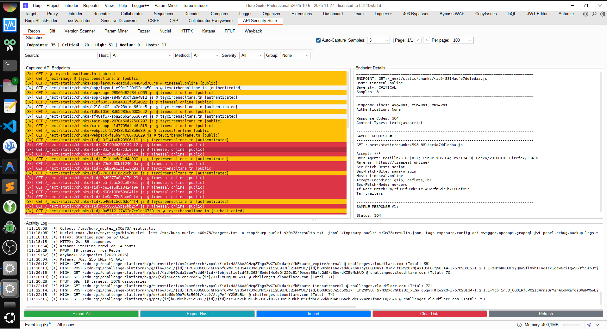

### Fuzzer Tab
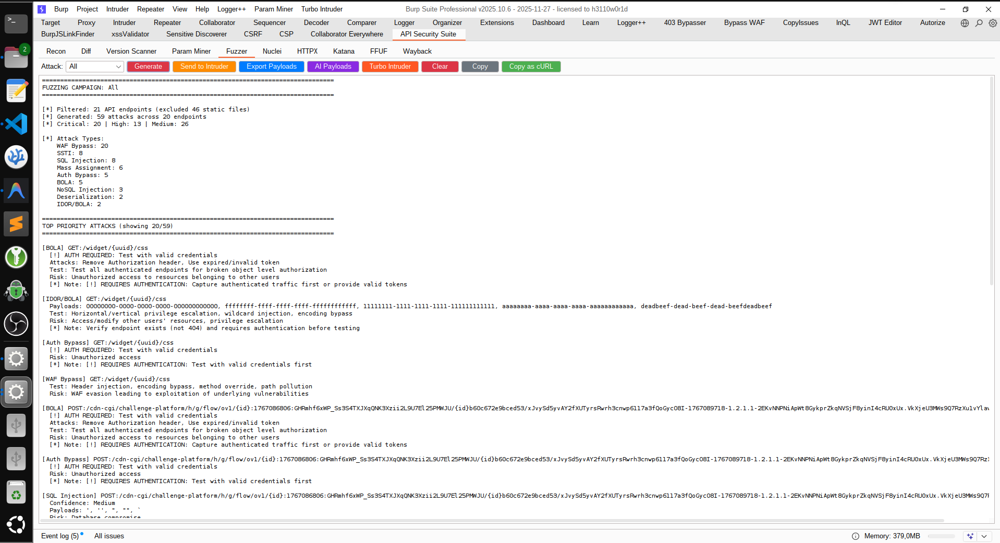

### Parameter Analysis
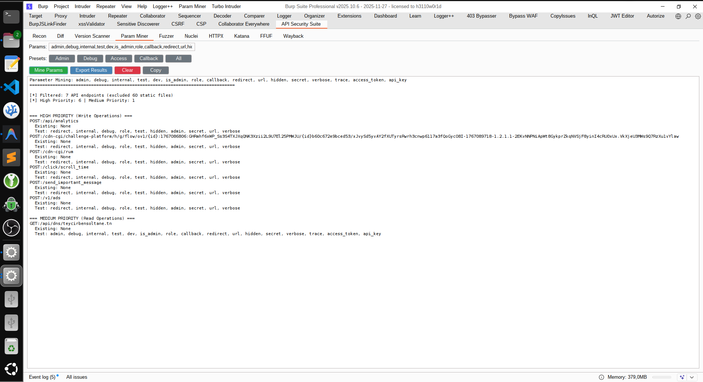

### Diff View


### ApiHunter Tab
Integrated gap-fill + deep-search runner calibrated to complement Nuclei/HTTPX/Katana coverage.

### Nuclei Tab
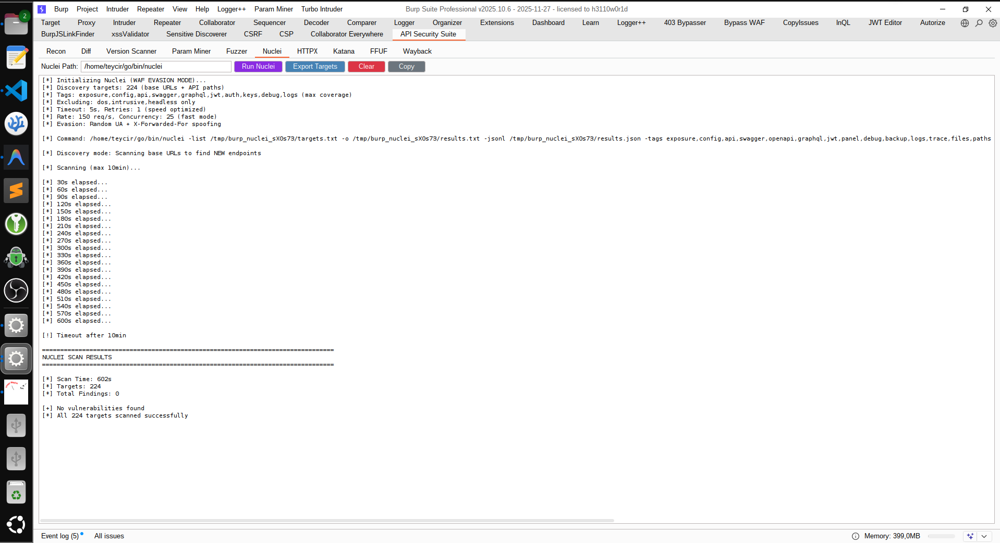

### Katana Tab
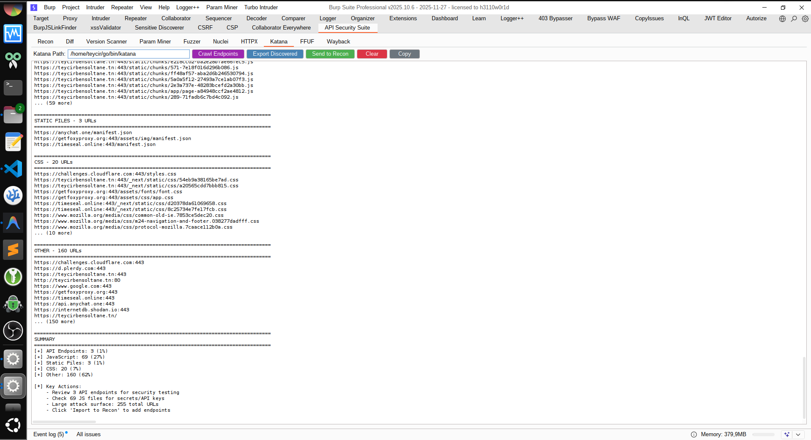

### HTTPX Tab
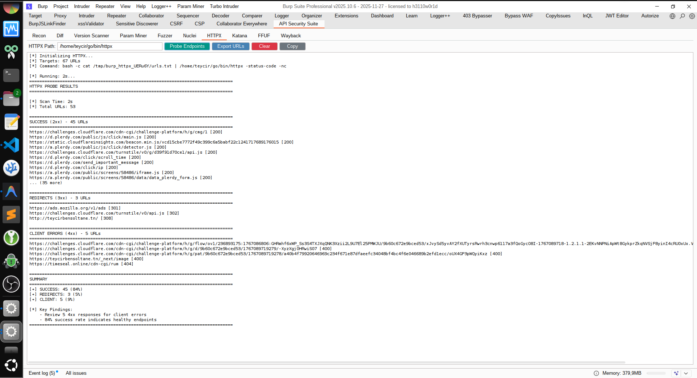

### FFUF Tab
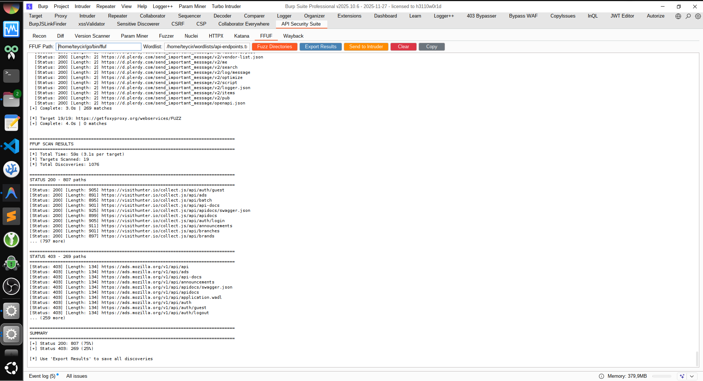

### Wayback Tab
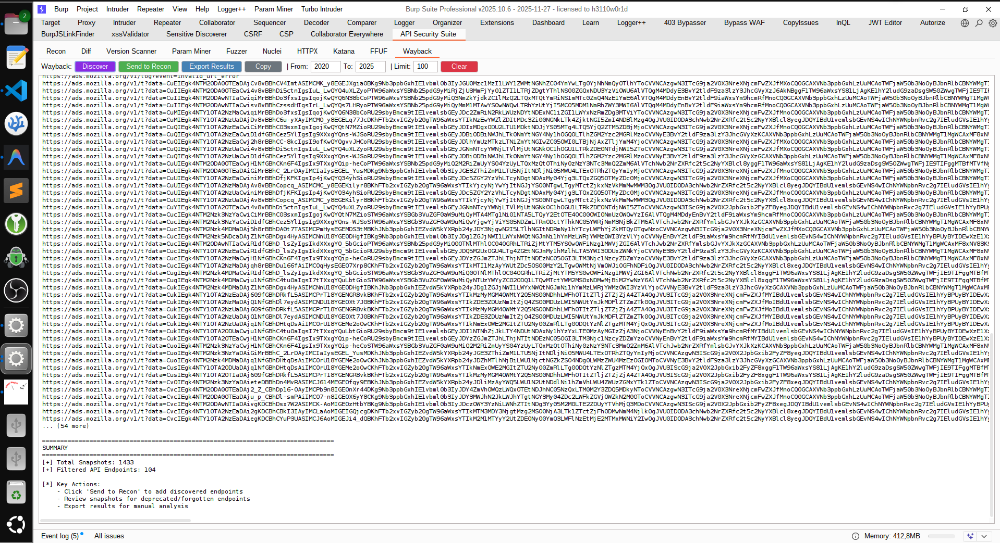

### Export Options
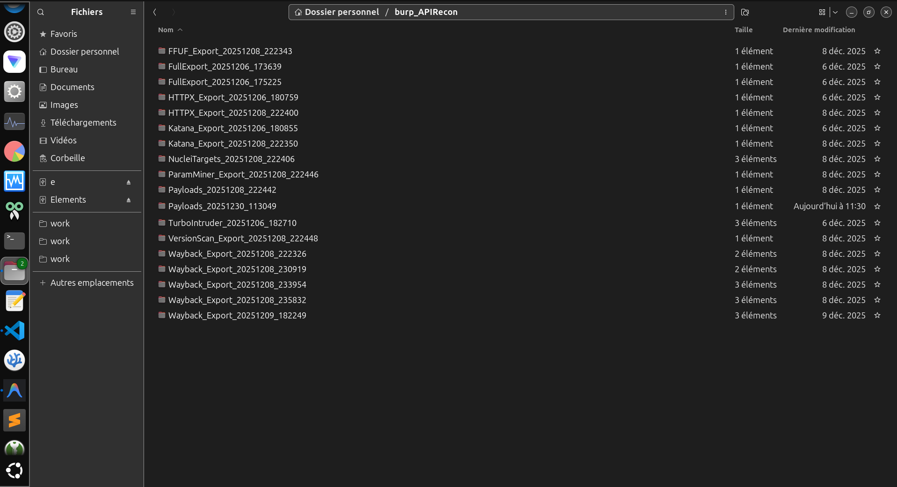

### Turbo Intruder Export
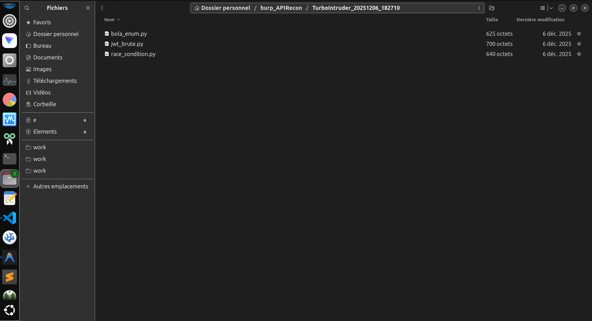

### Version Info
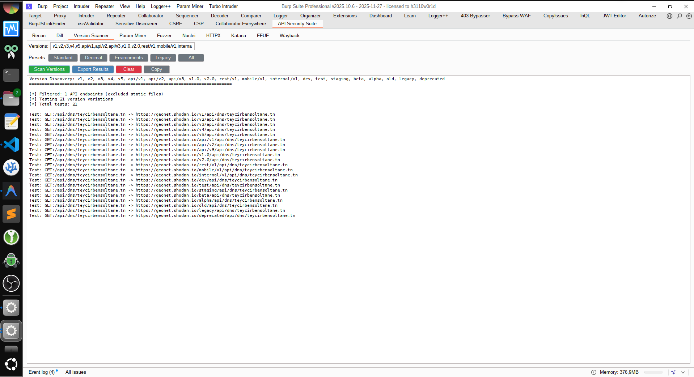

## Purpose

BurpAPISecuritySuite is a complete API security testing toolkit that:
- **Captures & analyzes** API traffic with smart normalization
- **Generates intelligent fuzzing** campaigns with 100+ attack vectors
- **Exports to multiple formats** for AI, Turbo Intruder, and Nuclei
- **Auto-configures Burp Intruder** with attack positions
- **Detects vulnerabilities** across OWASP API Top 10

## Key Features

### 🎯 Reconnaissance
- **Auto-Capture**: Monitors all HTTP/Proxy traffic automatically
- **Smart Normalization**: Groups similar endpoints (`/users/123` → `/users/{id}`)
- **Comprehensive Extraction**: Parameters, headers, auth methods, request/response bodies
- **Pattern Detection**: REST, GraphQL, SOAP, JSON/XML APIs
- **Security Analysis**: IDOR/BOLA, unauth endpoints, PII exposure, weak encryption
- **JWT Detection**: Automatic JWT extraction and security analysis
- **Diff Comparison**: Compare two API exports to detect changes
- **Import/Export**: Save and restore captured API data

### ⚡ Advanced Fuzzing
- **15 Attack Types**: BOLA, IDOR, SQLi, XSS, NoSQLi, SSTI, JWT, GraphQL, Race Conditions, Business Logic, WAF Bypass, and more
- **Smart Detection**: Context-aware vulnerability identification
- **108+ Attack Vectors**: Comprehensive payload library with bypass techniques
- **Severity Ratings**: Critical/High/Medium/Low risk classification
- **WAF Evasion**: Header injection, encoding bypass, method override, path manipulation

### 🔍 Discovery Tools
- **ApiHunter Deep Search**: Filtered/deduped endpoint scans with WAF-evasive gap-fill calibration for auth/workflow/API-logic issues
- **Version Scanner**: Test API version variations (v1, v2, dev, staging, legacy)
- **Param Miner**: Discover hidden parameters (admin, debug, internal, callback)
- **SQLMap Verify**: Confirm SQL injection candidates with evidence-driven sqlmap checks
- **Dalfox Verify**: Confirm reflected XSS candidates with Dalfox proof output
- **API Asset Discovery**: Expand first-party scope with `subfinder` + `dnsx` + `httpx`
- **OpenAPI Drift**: Compare observed traffic vs OpenAPI spec for undocumented/missing endpoints
- **Counterfactual Differentials**: Scoreless, non-destructive invariant breaks for representation/auth/identifier drift
- **Sequence Invariants**: Non-destructive deep-logic checks with confidence/evidence ledger export
- **Token Lineage Analysis**: Passive token/session lifecycle drift detection for logout/revoke/refresh rotation gaps
- **Cross-Interface Parity & Drift**: Detects REST/GraphQL/internal auth parity gaps, cache/auth drift, time-window flips, content-type policy drift, and replay-after-delete leakage
- **Wayback Machine**: Discover historical endpoints and forgotten APIs
- **Katana Crawler**: Deep web crawling with automatic endpoint discovery
- **HTTPX Probe**: Fast HTTP probing with technology detection
- **FFUF Fuzzer**: Directory and file fuzzing with wordlist support

### 🚀 Export & Integration
- **Burp Intruder**: Auto-configured attack positions (§markers§)
- **AI Context**: Structured data for ChatGPT/Claude payload generation
- **Turbo Intruder**: Ready-to-use Python scripts for race conditions & high-speed attacks
- **Nuclei**: Target export and integrated scanning with WAF evasion
- **Payload Library**: JSON export of all attack payloads
- **cURL Export**: Copy attacks as cURL commands for manual testing

## Comparison with Similar Tools

| Feature | BurpAPISecuritySuite | Burp Scanner Pro | OWASP ZAP | Postman |
|---------|---------------------|------------------|-----------|----------|
| **Price** | Free | $449/year | Free | Free/Paid |
| **API-Specific Focus** | ✅ Yes | ⚠️ Partial | ⚠️ Partial | ✅ Yes |
| **Auto-Capture & Normalization** | ✅ Yes | ❌ No | ⚠️ Basic | ❌ No |
| **BOLA/IDOR Detection** | ✅ Automated | ⚠️ Manual | ⚠️ Manual | ❌ No |
| **Attack Types** | 15 types | 100+ (generic) | 50+ (generic) | Limited |
| **API Payloads** | 108+ API-focused | Generic web | Generic web | Basic |
| **JWT Analysis** | ✅ Automatic | ⚠️ Extension needed | ⚠️ Extension needed | ⚠️ Manual |
| **GraphQL Testing** | ✅ Built-in | ❌ No | ⚠️ Limited | ⚠️ Manual |
| **Race Condition Testing** | ✅ Turbo Intruder | ✅ Turbo Intruder | ❌ No | ❌ No |
| **AI Integration** | ✅ Export AI Bundle + LLM payloads | ❌ No | ❌ No | ❌ No |
| **Version Scanner** | ✅ Built-in | ❌ No | ❌ No | ❌ No |
| **Parameter Mining** | ✅ Built-in | ⚠️ Extension needed | ❌ No | ❌ No |
| **Wayback Discovery** | ✅ Built-in | ❌ No | ❌ No | ❌ No |
| **External Tool Integration** | ✅ ApiHunter, Nuclei, SQLMap, Dalfox, HTTPX, Katana, FFUF, Subfinder, DNSX | ❌ No | ⚠️ Limited | ⚠️ Limited |
| **WAF Bypass Techniques** | ✅ 20+ methods | ⚠️ Some | ⚠️ Some | ❌ No |
| **Export Formats** | JSON, Intruder, Turbo, Nuclei, cURL | XML, HTML | XML, HTML, JSON | JSON, cURL |
| **Burp Community Support** | ✅ Yes | ❌ Pro only | N/A | N/A |
| **Learning Curve** | Low | Medium | Medium | Low |
| **Best For** | API pentesting, bug bounty | Full web app testing | DAST automation | API development |

### Why Choose BurpAPISecuritySuite?

- **API-First Design**: Built specifically for modern API security testing (REST, GraphQL, SOAP)
- **Free & Open Source**: All features available without licensing costs
- **Intelligent Automation**: Auto-detects BOLA/IDOR vulnerabilities across all authenticated endpoints
- **AI-Powered**: Export all-tab AI bundles (plus sequence evidence ledger) for ChatGPT/Claude triage
- **Differential-First Logic Coverage**: Includes scoreless counterfactual drift checks that many signature scanners miss
- **Token Lifecycle Drift Coverage**: Adds passive token-lineage analysis for logout/refresh/session-rotation gaps many scanners ignore
- **Comprehensive Coverage**: 15 attack types with 108+ API-specific payloads
- **External Tool Integration**: Seamlessly integrates with ApiHunter, Nuclei, SQLMap, Dalfox, HTTPX, Katana, FFUF, Subfinder, and DNSX
- **Works with Burp Community**: No need for expensive Burp Pro license
- **Active Development**: Regular updates with new attack vectors and features

## Installation

1. Burp → Extender → Extensions → Add → Python
2. Select: `BurpAPISecuritySuite.py`
3. Extension loads and starts capturing automatically

## Requirements

- Burp Suite (Professional or Community Edition)
- Jython Standalone JAR (https://www.jython.org/download)

## Usage

### Basic Workflow

1. **Capture**: Browse/scan target API with auto-capture enabled
2. **Review**: Check the `Recon` tab to inspect captured endpoints and findings
3. **Deep Logic (Optional)**: In `Passive Discovery`, click `Run Differential` for scoreless counterfactual checks, or `Run Invariants` for the full deep-logic stack
4. **Refresh Cache (Optional)**: In `Recon`, click `Refresh Invariants` to refresh Differential + Sequence + Golden + State Matrix + Token Lineage + Parity Drift results before export
5. **Export**: In `Recon`, click `Export AI Bundle` to generate all-tab AI context
6. **Generate**: Feed exported JSON to an LLM (ChatGPT, Claude, etc.) for triage/payload planning

### Tab Overview

#### 1. Recon Tab
- **Auto-Capture Toggle**: Enable/disable automatic traffic capture
- **Sample Limit**: Configure samples per endpoint (1, 3, 5, 10)
- **Pagination**: Navigate large endpoint lists (50, 100, 200, 500 per page)
- **Search & Filters**: Filter by host, method, severity, search term
- **Grouping**: Group endpoints by Host, Method, Auth, Encryption
- **Export All**: Export complete API analysis to JSON
- **Export Host**: Export specific host endpoints
- **Export AI Bundle**: Export all-tab AI-ready context + LLM request payloads
- **Import**: Load Suite exports, Excalibur HAR/session sidecars, or `excalibur-burp-bridge/v1` bundles
- **Postman**: Export scoped endpoints to Postman Collection v2.1
- **Insomnia**: Export scoped endpoints to Insomnia import JSON
- **Tool Health**: One-click diagnostics for ApiHunter/Nuclei/HTTPX/Katana/FFUF/Wayback/SQLMap/Dalfox/Subfinder/DNSX binary compatibility
- **Button Help**: Quick guide for Recon buttons and expected outputs
- **Refresh Invariants**: Refresh Differential + Sequence + Golden + State Matrix + Token Lineage + Parity Drift analysis from captured endpoints before AI export
- **Invariant Status Line**: Shows Differential, Sequence, Golden, State Matrix, Token Lineage, and Parity Drift cache counts with source/update time
- **Clear Data**: Reset captured Recon endpoints and Logger events together

#### Logger Tab
- **Timeline View**: High-signal request timeline (`tool`, `method`, `host/path`, `status`, `len`, `type`, `tags`).
- **Two-Line Toolbar**: Controls are split across two rows to avoid hidden/clipped actions.
- **Noise Filter**: Shared noise suppression aligned with Recon filtering heuristics.
- **Auto Prune**: Trims oldest Logger rows when `Max Memory` is exceeded (default `20,000` rows).
- **Logging Off**: Single capture toggle for Logger ingestion (`on/off` model).
- **Clear Data**: Shared clear action that resets both Logger events and Recon captured data.
- **ReqM / RespM**: Useful marker counts by default, and regex hit counts when regex is active.
- **Grep + Rules**: `Grep Values...`, `Tag Rules...`, and saved regex workflow (`Save Regex` + saved filters).
- **Header Sorting**: Click a header to sort, Shift+click to add a second sort key.
- **Right-Click Ops**: `Show Endpoint Detail`, `Send Selected To Repeater`, `Copy Selected Rows`, and bulk selection.

#### 2. Diff Tab
- **Load Export 1/2**: Load two API exports for comparison
- **Compare**: Identify added, removed, and unchanged endpoints
- **Copy**: Copy diff results to clipboard

#### 3. Version Scanner Tab
- **Version Input**: Comma-separated version strings to test
- **Presets**: Standard, Decimal, Environments, Legacy, All
- **Scan Versions**: Test all API endpoints with version variations
- **Export Results**: Save discovered versions to file

#### 4. Param Miner Tab
- **Param Input**: Comma-separated parameter names to test
- **Presets**: Admin, Debug, Access, Callback, All
- **Mine Params**: Discover hidden parameters in API endpoints
- **Export Results**: Save parameter mining results

#### 5. Fuzzer Tab
- **Attack Type Dropdown**: All, BOLA, IDOR, Auth Bypass, SQLi, XSS, SSRF, XXE, WAF Bypass
- **Generate**: Create fuzzing campaign with intelligent attack detection
- **Send to Intruder**: Export to Burp Intruder with pre-configured positions
- **Export Payloads**: Save all payloads to JSON
- **Turbo Intruder**: Generate Python scripts for high-speed attacks
- **Copy as cURL**: Export attack as cURL command

#### 6. Auth Replay Tab
- **Scope**: Replay Selected Endpoint, Filtered View, or All Endpoints
- **Max**: Limit endpoints per run for faster triage
- **Guest/User/Admin Headers**: Set profile headers in `Name: value` format
- **Extract**: Open searchable popup to pick captured auth/session headers
- **Run Replay**: Replay requests per profile and compare response behavior
- **Stop**: Cancel active replay safely
- **Findings Output**: Severity-scored evidence for likely BOLA/authz drift

#### 7. Passive Discovery Tab
- **Passive Only**: Analyzes captured/replayed proxy traffic without active requests
- **Mode Selector**: Run `All` or per-category checks (`API3`, `API4`, `API5`, `API6`, `API9`, `API10`)
- **Scope Selector**: Analyze `All Endpoints`, `Filtered View`, or current host scope
- **Run Differential**: Run scoreless counterfactual checks for representation/auth/identifier precedence drift (passive-only)
- **Run Token Lineage**: Run passive token/session family checks for logout/revoke/refresh invalidation drift
- **Run Parity Drift**: Run cross-interface parity checks plus cache/auth, time-window, content-type, and replay-after-delete drift heuristics
- **Run Invariants**: Run full non-destructive stack (Differential + Sequence + Golden + State + Token Lineage + Parity Drift) for deep workflow/token/state analysis
- **Run All Advanced**: One-click execution of all advanced deep-logic engines
- **Abuse Chains**: Build shortest graph-to-replay exploit chains (`auth -> object access -> state change`)
- **Proof Mode**: Generate minimal reproducible packet sets with expected vulnerable vs safe signals
- **Spec Guardrails**: Derive enforceable auth/param/transition rules from observed behavior and flag violations
- **Role Delta**: Compare role-level behavior (guest/user/admin-like) and rank suspicious parity for BOLA/BFLA triage
- **Run / Stop / Clear**: Execute discovery, cancel safely, and reset output quickly
- **Export / Copy**: Save findings or copy report text
- **Export Ledger**: Save Differential + Sequence + Golden + State Matrix + Token Lineage artifacts as JSON files
- **Advanced Exports**: Also writes `abuse_chain_*`, `proof_mode_packet_sets`, `spec_guardrails_*`, and `role_delta_*` JSON artifacts
- **Output**: Severity/categorical summary plus top findings for triage

#### 8. ApiHunter Tab
- **ApiHunter Path**: Configure `apihunter` binary path (default auto-detection searches runtime `PATH`, then shell probes (`bash -lc` and `bash -ic`) via `command -v`, and copies the discovered absolute path; no static fallback candidates)
- **Runtime PATH Resolve**: On `Run ApiHunter`, the suite re-resolves `apihunter` from PATH (process + shell probe) and auto-updates the field to the resolved absolute binary when available
- **Calibration**: `Quick (Desktop Preset)`, `Balanced (Desktop Preset)` (default), `Deep (Desktop Preset)`
- **Top Findings Min**: Operator-configurable `Critical` / `High` / `Medium` threshold for summary triage noise control
- **Use Custom Targets**: Checkbox to force ApiHunter input from the `Custom Targets...` popup instead of Recon-filtered scope
- **Custom Targets Popup**: Multiline editor (`max 20` entries, one per line) with strict sanitization and canonical base URL normalization (`scheme://host[:port]/`), including de-duplication and invalid-line rejection
- **Validation Enforcement**: When `Use Custom Targets` is enabled, runs fail fast if popup content is empty, exceeds limit, or contains invalid URL lines
- **Always Filtered Source**: Consumes current Recon filtered view and emits de-duplicated host-base targets (`scheme://host[:port]/`) for ApiHunter
- **Run ApiHunter**: Executes ApiHunter using ApiHunter-native command behavior (Burp acts as a thin launcher + result renderer)
- **Default Command Model**: Burp does not apply extra runtime heuristics (no Burp-side watchdog caps or endpoint-expansion overrides); default flags mirror ApiHunter Desktop presets
- **Desktop Preset Parity**:
  - `Quick`: `--no-discovery`, `--max-endpoints 40`, `--concurrency 4`, `--timeout-secs 12`, `--retries 1`, `--delay-ms 0`, and disables heavy scanners (mass-assignment, oauth-oidc, rate-limit, cve-templates, websocket)
  - `Balanced`: `--no-discovery`, `--max-endpoints 80`, `--concurrency 5`, `--timeout-secs 15`, `--retries 1`, `--delay-ms 50`
  - `Deep`: `--active-checks --response-diff-deep --no-discovery`, `--max-endpoints 0`, `--concurrency 6`, `--timeout-secs 20`, `--retries 2`, `--delay-ms 100`, `--waf-evasion`, `--per-host-clients`, `--adaptive-concurrency`
- **Enable Custom**: Opt in to full command override with placeholders (`{apihunter_path}`, `{targets_file}`, `{results_file}`)
- **Preset Visibility**: Preset dropdown is always visible and seeded with Desktop-equivalent templates
- **Stop / PKill Tools**: Cancel active runs safely or emergency-stop external scanner processes
- **Export Targets**: Save filtered/deduped host-base target list for offline ApiHunter usage
- **Output**: Parsed NDJSON findings summary with severity/scanner/runtime breakdown plus surfaced launcher/parse/runtime errors
- **Top Findings Signal Mode**: Shows findings returned by ApiHunter command output (sorted by severity with evidence/remediation context)
- **Top Findings Display Filtering**: Selected minimum severity is applied to Burp Top Findings rendering (`Critical` / `High` / `Medium`), while scanner output statistics remain complete.

#### 9. Nuclei Tab
- **Nuclei Path**: Configure path to nuclei binary
- **Profile**: `Fast`, `Balanced`, `Deep` API-discovery scan presets
- **Run Nuclei**: Execute Nuclei scanner with WAF evasion
- **GraphQL Templates**: 29+ GraphQL-specific templates for detection and exploitation
- **Target Bases...**: Open multiline popup to define explicit base URLs/hosts
- **Only Base+Derivatives**: Restrict scans to popup scope and same base-domain derivatives
- **Enable Custom**: Opt in to override default command with your own template
- **Preset Cmd + ? Help**: Auto-fill common commands and show usage guidance
- **Stop**: Cancel active scans safely
- **PKill Tools**: Emergency kill for `nuclei/httpx/katana/ffuf/waybackurls/gau/sqlmap/dalfox/subfinder/dnsx`
- **Cross-Platform Kill**: Uses `taskkill` on Windows and `pkill` (with `killall` fallback) on Linux/macOS
- **Export Targets**: Save target list for external scanning
- **Features**: Header-based spoofing, rate limiting, clear error reporting

#### 10. HTTPX Tab
- **HTTPX Path**: Configure path to httpx binary
- **Probe Endpoints**: Fast HTTP probing with technology detection
- **Enable Custom**: Opt in to override default command with your own template
- **Preset Cmd + ? Help**: Auto-fill common probe profiles and usage
- **Stop**: Cancel active probes safely
- **PKill Tools**: Emergency kill for scanner processes
- **Export URLs**: Save URLs for external tools

#### 11. Katana Tab
- **Katana Path**: Configure path to katana binary
- **Crawl Endpoints**: Deep web crawling for endpoint discovery
- **Target Bases...**: Open multiline popup to define explicit base URLs/hosts
- **Only Base+Derivatives**: Restrict crawls to popup scope and same base-domain derivatives
- **Enable Custom**: Opt in to override default command with your own template
- **Preset Cmd + ? Help**: Auto-fill crawl depth profiles and usage
- **Stop**: Cancel active crawls safely
- **PKill Tools**: Emergency kill for scanner processes
- **Export Discovered**: Save discovered endpoints
- **Send to Recon**: Import discovered endpoints to Recon tab

#### 12. FFUF Tab
- **FFUF Path**: Configure path to ffuf binary
- **Wordlist**: Select wordlist for fuzzing
- **Target Bases...**: Open multiline popup to define explicit base URLs/hosts
- **Only Base+Derivatives**: Restrict fuzzing to popup scope and same base-domain derivatives
- **Fuzz Directories**: Directory and file fuzzing
- **Auto Scope**: Prioritizes first-party hosts and filters noisy third-party/CDN targets
- **PKill Tools**: Emergency kill for scanner processes
- **Export Results**: Save fuzzing results
- **Send to Intruder**: Export results to Burp Intruder

#### 13. Wayback Tab
- **Date Range**: Configure from/to years for historical search
- **Limit**: Set maximum results to retrieve
- **Discover**: Query Wayback Machine for historical endpoints
- **Target Bases...**: Open multiline popup to define explicit base URLs/hosts
- **Only Base+Derivatives**: Restrict discovery to popup scope and same base-domain derivatives
- **Auto Scope**: Limits default queries to first-party hosts/paths from Recon
- **Noise Exclusion**: Drops common ad-tech/tracker hosts in default Wayback mode
- **Enable Custom**: Opt in to override built-in queries with waybackurls/gau commands
- **Preset Cmd + ? Help**: Auto-fill passive collection presets and usage
- **Stop**: Cancel active discovery safely
- **PKill Tools**: Emergency kill for scanner processes
- **Send to Recon**: Import discovered endpoints to Recon tab
- **Export Results**: Save discovered endpoints

#### 14. SQLMap Verify Tab
- **SQLMap Path**: Configure path to local `sqlmap`
- **Profile**: `Fast`, `Balanced`, `Deep` command tuning presets
- **Run Verify**: Replay SQLi-priority targets and collect evidence-backed confirmations
- **Max Targets / Timeout**: Control verification breadth and per-target duration
- **Stop / PKill Tools**: Cancel or emergency-stop tool processes
- **Send to Recon**: Import verified SQLi endpoints back into Recon for follow-up
- **Export Results**: Save verification output to file

#### 15. Dalfox Verify Tab
- **Dalfox Path**: Configure path to local `dalfox`
- **Profile**: `Fast`, `Balanced`, `Deep` command tuning presets
- **Run Verify**: Replay XSS-priority targets and capture Dalfox confirmation output
- **Max Targets / Timeout**: Tune scan duration and coverage
- **Stop / PKill Tools**: Cancel active verification or emergency-stop tool processes
- **Send to Recon**: Import verified XSS candidates to Recon
- **Export Results**: Save Dalfox findings to file

#### 16. API Assets Tab
- **Domains Input**: Optional manual domains list (comma/newline); auto-derives from Recon when empty
- **Profile**: `Fast`, `Balanced`, `Deep` stage tuning for `subfinder`/`dnsx`/`httpx`
- **Pipeline**: Runs `subfinder` → `dnsx` → `httpx` for alive API asset discovery
- **Run Discovery**: Find additional first-party API hosts/URLs beyond captured paths
- **Stop / PKill Tools**: Cancel staged discovery or emergency-stop tool processes
- **Send to Recon**: Import discovered assets into Recon
- **Export Results**: Save discovered URLs

#### 17. OpenAPI Drift Tab
- **Spec Source**: Load OpenAPI/Swagger file from local path or URL
- **Generate OpenAPI**: One-click OpenAPI 3.0.3 generation from captured Recon traffic
- **Run Drift**: Compare observed traffic vs spec and report endpoint/parameter drift
- **Findings**: Undocumented observed endpoints, missing observed traffic, parameter mismatches
- **Stop / PKill Tools**: Cancel active drift analysis safely
- **Send to Recon**: Import spec-missing candidates into Recon for probing
- **Export Results**: Save drift output report

#### 18. GraphQL Tab
- **Targets Input**: Optional manual GraphQL targets (auto-detects from Recon if empty)
- **Show Targets**: Preview candidate GraphQL endpoints before execution
- **Run Analysis**: Run GraphQL-focused multi-tool analysis workflow
- **Stop / PKill Tools**: Cancel active analysis or emergency-stop tools
- **Send to Recon**: Import GraphQL findings/candidates into Recon
- **Export Results**: Save GraphQL analysis output

## Advanced Fuzzing Capabilities

### Attack Types Detected

1. **BOLA (Broken Object Level Authorization)**
   - Tests ALL authenticated endpoints
   - Horizontal/vertical privilege escalation
   - Token manipulation, batch requests

2. **IDOR (Insecure Direct Object Reference)**
   - ID enumeration (numeric, UUID, ObjectID)
   - Wildcard injection, encoding bypass
   - Parameter pollution

3. **SQL Injection**
   - Boolean-based, union-based, time-based blind
   - Error-based, stacked queries
   - 38+ payloads

4. **XSS (Cross-Site Scripting)**
   - Reflected parameter exploitation
   - Context breaking, polyglot payloads
   - Event handlers, template injection

5. **NoSQL Injection**
   - MongoDB operators ($gt, $ne, $regex)
   - Array notation, where clause injection

6. **JWT Exploitation**
   - Algorithm confusion (alg:none)
   - kid injection, claim manipulation

7. **GraphQL Abuse**
   - Introspection queries (schema extraction)
   - Batching attacks (array-based and alias-based)
   - Depth attacks (nested query DoS)
   - Directive overloading (@skip, @include abuse)
   - Field suggestion (typo-based schema discovery)
   - Circular fragments (recursive DoS)
   - Mutation injection

8. **SSTI (Server-Side Template Injection)**
   - Jinja2, Freemarker, Velocity
   - RCE payloads

9. **Race Conditions**
   - TOCTOU exploitation
   - Parallel request techniques

10. **Business Logic**
    - Price/quantity manipulation
    - Workflow bypass

11. **WAF Bypass**
    - Header injection (X-Forwarded-For, X-Original-URL)
    - Encoding bypass (URL, Unicode, Hex, HTML entities)
    - HTTP method override (X-HTTP-Method-Override)
    - Path manipulation (dot encoding, null bytes, semicolons)
    - Content-Type manipulation
    - Protocol smuggling (CL.TE, TE.CL)

12. **Path Traversal**
    - Directory traversal payloads
    - Encoded path manipulation
    - Null byte injection

13. **SSRF (Server-Side Request Forgery)**
    - Internal IP targeting
    - Cloud metadata access
    - DNS rebinding

14. **XXE (XML External Entity)**
    - File disclosure
    - SSRF via XXE
    - Denial of Service

15. **Deserialization**
    - Java deserialization
    - PHP object injection
    - Python pickle exploitation

### Exported Data Structure

```json
{
  "metadata": {
    "timestamp": "20240115_143022",
    "total_endpoints": 15,
    "total_requests": 47
  },
  "endpoints": [
    {
      "endpoint": "GET:/api/users/{id}",
      "method": "GET",
      "normalized_path": "/api/users/{id}",
      "host": "api.example.com",
      "sample_count": 3,
      "parameters": {
        "url": ["id"],
        "body": [],
        "cookie": ["session"],
        "json": []
      },
      "auth_methods": ["Bearer Token"],
      "response_codes": [200, 404],
      "content_types": ["application/json"],
      "api_patterns": ["REST API", "JSON API", "CRUD: GET"],
      "sample_requests": [...]
    }
  ],
  "api_structure": {
    "api_types": ["REST API", "JSON API"],
    "http_methods": ["GET", "POST", "PUT", "DELETE"],
    "auth_methods": ["Bearer Token", "API Key"],
    "base_paths": ["/api/", "/v1/"]
  },
  "security_observations": [
    {
      "type": "Potential IDOR/BOLA",
      "severity": "Critical",
      "count": 5,
      "examples": ["GET:/api/users/{id}", "GET:/api/orders/{id}"],
      "recommendation": "Implement object-level authorization checks"
    },
    {
      "type": "Unauthenticated Endpoints",
      "severity": "High",
      "count": 3,
      "examples": ["GET:/api/health", "GET:/api/version"]
    },
    {
      "type": "Weak Encryption (Base64)",
      "severity": "High",
      "count": 2,
      "examples": [{"endpoint": "POST:/api/auth", "types": ["Base64"]}],
      "recommendation": "Use proper encryption (AES-256, TLS 1.3)"
    }
  ],
  "llm_prompt": "# API Red Team Extension Generation\n\n..."
}
```

## Data & Export

### What Gets Captured

### Per Endpoint
- HTTP method and normalized path
- Host, protocol, port
- Query string and all parameter types (URL, body, cookie, JSON)
- Request/response headers
- Request/response bodies (truncated to 20KB)
- Response status codes
- Content types
- Authentication methods detected
- API patterns (REST, GraphQL, SOAP, etc.)

### Analysis
- API structure overview (types, methods, auth, base paths)
- Security observations (unauth endpoints, sensitive data)
- Endpoint grouping and deduplication
- Sample requests for each endpoint

## Integration

### LLM Prompt Integration

The export includes a pre-formatted prompt instructing the LLM to:

1. Analyze API structure and patterns
2. Identify attack vectors (BOLA, Mass Assignment, Rate Limiting, etc.)
3. Generate a custom Burp extension implementing:
   - IScannerCheck for automated testing
   - Passive and active scan methods
   - Tailored payloads for detected patterns
   - Clear reporting with severity ratings

## Workflow Examples

### 1. AI-Powered Payload Generation

```bash
# 1. Capture API traffic in Burp
# 2. (Optional) Run Passive Discovery → "Run Invariants"
# 3. (Optional) In Recon, click "Refresh Invariants"
# 4. In Recon, click "Export AI Bundle"
# 5. Feed ai_bundle.json / ai_all_tabs_context.json to ChatGPT/Claude:

"Analyze these API endpoints and generate 50 custom payloads for each 
vulnerability type. Focus on:
- Context-aware SQLi based on parameter names
- IDOR payloads matching observed ID patterns
- XSS payloads for detected reflection points
- JWT manipulation for the specific auth mechanism"
```

### 2. Turbo Intruder Race Condition

```bash
# 1. Generate fuzzing attacks
# 2. Click "Turbo Intruder" button
# 3. In Burp: Extensions → Turbo Intruder
# 4. Right-click target request → Send to Turbo Intruder
# 5. Load race_condition.py script
# 6. Execute for 50 parallel requests
```

### 3. Burp Intruder with Auto-Positions

```bash
# 1. Generate fuzzing attacks
# 2. Click "Send to Intruder"
# 3. Burp Intruder opens with §markers§ pre-configured
# 4. Load payloads from exported payloads.json
# 5. Launch attack
```

### Output Locations

```
~/burp_APIRecon/
├── FullExport_TIMESTAMP/
│   ├── api_analysis.json
│   └── excalibur_bridge_bundle.json
├── HostExport_HOSTNAME_TIMESTAMP/
│   ├── api_analysis.json
│   └── excalibur_bridge_bundle.json
├── Payloads_TIMESTAMP/
│   └── payloads.json (idor, sqli, xss, nosqli, ssrf, xxe, ssti, deserialization, waf_bypass)
├── AI_Context_TIMESTAMP/
│   ├── ai_context.json
│   ├── ai_bundle.json
│   ├── ai_all_tabs_context.json
│   ├── ai_vulnerability_context.json
│   ├── ai_behavioral_analysis.json
│   ├── ai_counterfactual_differential_findings.json
│   ├── ai_counterfactual_differential_summary.json
│   ├── ai_sequence_invariant_findings.json
│   ├── ai_sequence_evidence_ledger.json
│   ├── ai_golden_ticket_findings.json
│   ├── ai_golden_ticket_ledger.json
│   ├── ai_state_transition_findings.json
│   ├── ai_state_transition_ledger.json
│   ├── ai_token_lineage_findings.json
│   ├── ai_token_lineage_ledger.json
│   ├── ai_parity_drift_findings.json
│   ├── ai_parity_drift_ledger.json
│   ├── ai_openai_request.json
│   ├── ai_anthropic_request.json
│   └── ai_ollama_request.json
├── SequenceInvariant_Export_TIMESTAMP/
│   ├── counterfactual_differential_findings.json
│   ├── counterfactual_differential_summary.json
│   ├── sequence_invariant_findings.json
│   ├── sequence_evidence_ledger.json
│   ├── golden_ticket_findings.json
│   ├── golden_ticket_ledger.json
│   ├── state_transition_findings.json
│   ├── state_transition_ledger.json
│   ├── token_lineage_findings.json
│   ├── token_lineage_ledger.json
│   ├── parity_drift_findings.json
│   └── parity_drift_ledger.json
├── TurboIntruder_TIMESTAMP/
│   ├── race_condition.py
│   ├── bola_enum.py
│   └── jwt_brute.py
├── VersionScan_Export_TIMESTAMP/
│   └── version_scan.txt
├── ParamMiner_Export_TIMESTAMP/
│   └── param_mining.txt
└── NucleiTargets_TIMESTAMP/
    └── targets.txt
```

### Best Practices

### Reconnaissance Phase
- **Capture Authenticated Traffic**: Login first to capture protected endpoints
- **Exercise All Features**: Click through entire application for complete coverage
- **Use Multiple Roles**: Capture traffic as admin, user, guest for BOLA detection
- **Review Statistics**: Check Critical/High/Medium counts in stats panel

### Fuzzing Phase
- **Start with "All"**: Generate comprehensive attack campaign first
- **Focus on High-Risk**: Filter by severity for critical endpoints
- **Verify Detections**: Review generated attacks before sending to Intruder
- **Batch Testing**: Use Turbo Intruder for race conditions and high-speed enumeration

### AI Integration
- **Export Context Early**: Generate AI context after initial capture
- **Run + Refresh Invariants Before Export**: Add fresh deep-logic evidence (Differential + Sequence + Golden + State Matrix + Token Lineage + Parity Drift) before sending data to AI
- **Iterate Payloads**: Use AI-generated payloads, test, refine prompt
- **Combine Techniques**: Merge AI payloads with built-in payload library

### Automation
- **Nuclei Integration**: Run Nuclei for quick vulnerability validation
- **Export Targets**: Use target lists with ffuf, wfuzz, or custom scripts
- **CI/CD Integration**: Automate exports for regression testing

## Technical Information

### Technical Details

- **Normalization**: Replaces numeric IDs, UUIDs, ObjectIDs with placeholders
- **Deduplication**: Tracks unique endpoints by method + normalized path
- **Truncation**: Bodies limited to 20KB, samples limited to 3 per endpoint
- **Auth Detection**: Identifies Bearer, Basic, API Key, Session Cookie
- **Pattern Matching**: Regex-based detection for REST, GraphQL, SOAP

### Limitations

- Does not capture WebSocket traffic
- Binary responses not fully analyzed
- Large responses truncated (20KB limit)
- Requires Jython (Python 2.7 syntax)

## Use Cases

- **API Penetration Testing**: Comprehensive fuzzing with 108+ attack vectors
- **Bug Bounty Hunting**: Automated BOLA/IDOR detection and exploitation
- **Security Research**: Advanced attack techniques (race conditions, JWT, GraphQL)
- **Red Team Operations**: Turbo Intruder scripts for high-speed attacks
- **AI-Assisted Testing**: Generate custom payloads with ChatGPT/Claude
- **CI/CD Security**: Export targets for automated regression testing
- **Training & Education**: Learn API vulnerabilities through real-world examples

## Documentation

- [Complete Documentation Index](docs/DOCUMENTATION-INDEX.md)
- [Architecture Overview](docs/Architecture.md)
- [GraphQL Fuzzing Validation](docs/GRAPHQL_VALIDATION.md)
- [Logger++ Tags Reference](docs/loggerpp_tags.md)

## FAQ

### General Questions

**Q: Does this work with Burp Suite Community Edition?**

A: Yes! All core features work with both Community and Professional editions. However, some advanced Burp features like Scanner integration require Pro.

**Q: Why is the extension not capturing traffic?**

A: Check that:
- Auto-Capture toggle is enabled in the Recon tab
- You're browsing through Burp's proxy
- The target is sending HTTP/HTTPS traffic (WebSockets not supported)
- Check the Activity Log for any error messages

**Q: How do I install Jython?**

A: Download Jython Standalone JAR from https://www.jython.org/download, then in Burp: Extender → Options → Python Environment → Select File → Choose the jython-standalone-*.jar file.

### Performance & Limits

**Q: How many endpoints can it handle?**

A: The extension efficiently handles 500+ endpoints with automatic rotation when the limit (800) is reached. Older endpoints are automatically removed.

**Q: Why are responses truncated to 20KB?**

A: To prevent memory issues with large responses while preserving useful analysis context. The current default body capture cap is 20KB.

**Q: Can I increase the sample limit per endpoint?**

A: Yes, use the "Samples" dropdown in the Recon tab (1, 3, 5, or 10 samples per endpoint).

### Fuzzing & Attacks

**Q: Why am I not seeing any BOLA/Auth Bypass attacks?**

A: These attacks require authenticated endpoints. Make sure to:
- Login to the application first
- Capture traffic while authenticated
- Look for endpoints with Bearer tokens, API keys, or session cookies

**Q: How do I use the generated attacks?**

A: Three ways:
1. **Burp Intruder**: Click "Send to Intruder" for automated testing
2. **Turbo Intruder**: Export scripts for high-speed attacks
3. **Manual**: Use "Copy as cURL" for command-line testing

**Q: What's the difference between "All" and specific attack types?**

A: "All" generates comprehensive attacks across all vulnerability types. Specific types (e.g., "SQLi") focus only on that vulnerability class for targeted testing.

**Q: How do I test GraphQL endpoints effectively?**

A: Three-pronged approach:
1. **Fuzzer Tab**: Select "GraphQL" attack type for 40+ GraphQL-specific payloads (introspection, batching, directive overloading, field suggestion)
2. **Nuclei Tab**: Run with `-tags graphql` for 29+ templates covering misconfigurations and detection
3. **Manual Testing**: Use "Copy as cURL" to test introspection, batching, and depth attacks manually

The Fuzzer detects GraphQL endpoints automatically and generates attacks for:
- Schema extraction via introspection
- DoS via batching (array/alias) and depth attacks
- Field suggestion for schema discovery when introspection is disabled
- Directive overloading (@skip, @include abuse)
- Circular fragment DoS
- Unauthorized mutations

### External Tools

**Q: Do I need to install ApiHunter/Nuclei/HTTPX/Katana/FFUF?**

A: Only if you want to use those specific tabs. The core extension works without them. Install from:
- ApiHunter: https://github.com/Teycir/ApiHunter (or local clone at `~/Repos/ApiHunter`, then build `target/release/apihunter`)
- Nuclei: https://github.com/projectdiscovery/nuclei
- HTTPX: https://github.com/projectdiscovery/httpx
- Katana: https://github.com/projectdiscovery/katana
- FFUF: https://github.com/ffuf/ffuf

**Q: Where should I install these tools?**

A: Default paths:
- `~/Repos/ApiHunter/target/release/apihunter`
- `~/go/bin/nuclei`
- `~/go/bin/httpx`
- `~/go/bin/katana`
- `~/go/bin/ffuf`
- On Windows, common defaults are under `C:\\Users\\<you>\\go\\bin\\*.exe`

Or configure custom paths in each tab.
Tabs now auto-detect both Unix-style and Windows `*.exe` Go-bin locations when present.

**Q: How do custom command overrides work?**

A:
- Leave `Enable Custom` unchecked to use safe built-in defaults.
- Check `Enable Custom` to run exactly what you type in the command box.
- Use `Preset Cmd...` to auto-fill common commands quickly (still opt-in until `Enable Custom` is checked).
- Click `?` to see placeholders and examples for each tab.
- Custom commands run with `cmd /c` on Windows and `bash/sh -lc` on Linux/macOS.
- Built-in HTTPX and Katana defaults use native list-file flags (`-l` / `-list`) for cross-platform execution.

### Security Notes

- Custom command mode is intentionally strict and **opt-in** (`Enable Custom` must be checked).
- Rendered custom commands are validated for forbidden shell fragments (for example command chaining/redirection/subshell syntax).
- Executables are restricted by per-tool allow-lists in custom mode (for example `nuclei`, `httpx`, `katana`, `waybackurls`/`gau`, `apihunter`, `subfinder`).
- Placeholder context values are sanitized before template rendering, and quoted variants are available (`{targets_file_q}`, `{urls_file_q}`, etc.) for safer path interpolation.
- If your workflow needs complex shell logic outside this policy, run that command manually outside the extension.

**Q: Why does HTTPX show invalid option errors?**

A:
- Make sure you are using ProjectDiscovery `httpx`, not the Python `httpx` CLI tool.
- Recommended path: `~/go/bin/httpx`.
- The extension now validates local tool signatures and shows a fix hint when mismatched.

**Q: How do I fill Guest/User/Admin headers for Auth Replay quickly?**

A:
- In `Auth Replay`, click `Extract` next to Guest/User/Admin.
- A searchable popup opens with captured header candidates.
- Filter by endpoint text, header name, or token fragment.
- Select one item and click `OK`; the field is filled in `Name: value` format.

### Export & Integration

**Q: Where are exported files saved?**

A: All exports go to `~/burp_APIRecon/` with timestamped subdirectories. Check the Activity Log for exact paths.

**Q: How do I use the AI Context export?**

A: 
1. (Optional) Run `Passive Discovery` → `Run Invariants`
2. (Optional) In the `Recon` tab, click `Refresh Invariants`
3. In the `Recon` tab, click `Export AI Bundle`
4. Feed `ai_bundle.json` (or `ai_all_tabs_context.json`) to ChatGPT/Claude
5. Use `ai_sequence_evidence_ledger.json`, `ai_golden_ticket_ledger.json`, and `ai_state_transition_ledger.json` to prioritize what to test first

**Q: Can I import previously exported data?**

A: Yes. `Import` accepts:
- `api_analysis.json` (BurpAPISecuritySuite export)
- Excalibur `.har` exports
- Excalibur `-replay-studio.json` / `-cookies.json` / `-insights.json` sidecars (auto-discovered from the same session prefix)
- `excalibur_bridge_bundle.json` (`schema: excalibur-burp-bridge/v1`)

If Excalibur artifacts are detected, the tool auto-runs `Refresh Invariants` after import so Differential + Sequence + Golden + State + Token Lineage + Parity Drift caches are immediately ready.

**Q: Can I send captured requests to Postman or Insomnia?**

A: Yes. In the Recon tab, use:
- `Postman` to export `postman_collection.json` (Collection v2.1)
- `Insomnia` to export `insomnia_collection.json` (Insomnia import format)
- Both support scope selection: `All Endpoints`, `Filtered View`, or `Current Host`.

### Troubleshooting

**Q: Extension loaded but not showing in tabs?**

A: Check Burp's Extender → Extensions tab for errors. Common issues:
- Jython not configured correctly
- Python 2.7 syntax errors (extension uses Jython/Python 2.7)
- Insufficient memory (increase Burp's heap size)

**Q: "No endpoints captured" message?**

A: Ensure:
- You're actively browsing through Burp proxy
- Auto-Capture is enabled
- Target is making HTTP requests (not just loading static files)
- Check if endpoints are being filtered (images/fonts are auto-filtered)

**Q: Nuclei/HTTPX scan hangs or times out?**

A: 
- Check tool is installed and path is correct
- Verify network connectivity to targets
- Large scans may still take several minutes (default max timeout: 15 minutes)
- Use **Target Bases...** with **Only Base+Derivatives** to force strict single-target scope
- Use the **Stop** button in the same tab to cancel running external tools
- Check Activity Log for detailed error messages

**Q: Why are some endpoints marked as "Critical" or "High"?**

A: Severity is based on:
- **Critical**: Debug/admin endpoints, unauthenticated IDOR/BOLA
- **High**: Authenticated IDOR/BOLA, sensitive data exposure, weak encryption
- **Medium**: Error responses, reflected parameters
- **Info**: Standard endpoints

### Advanced Usage

**Q: How do I test for race conditions?**

A:
1. Generate fuzzing attacks (Fuzzer tab)
2. Click "Turbo Intruder" button
3. Load the exported `race_condition.py` script in Burp's Turbo Intruder
4. Configure for 50+ parallel requests

**Q: Can I customize attack payloads?**

A: Yes! Export payloads to JSON, modify them, then:
- Use in Burp Intruder manually
- Feed to AI for enhancement
- Create custom scripts with the payload library

**Q: How do I compare two API versions?**

A:
1. Export API data from version 1 ("Export All")
2. Clear data and capture version 2
3. Export version 2
4. Use Diff tab → Load both exports → Compare

**Q: What's the best workflow for bug bounty hunting?**

A:
1. Capture authenticated traffic (all user roles)
2. Review Critical/High severity endpoints first
3. Generate "All" attacks in Fuzzer
4. Focus on BOLA/IDOR endpoints
5. Use Version Scanner to find legacy APIs
6. Run Param Miner on high-value endpoints
7. Export to Nuclei for automated validation

### Technical Highlights

- **Clean Jython Architecture**: Modular design with testable core logic
- **Modular Extraction**: Heavy workflows extracted to helper modules (`heavy_runners.py`, `ai_prep_layer.py`, `behavior_analysis.py`)
- **Smart Detection**: Context-aware vulnerability identification
- **Performance Optimized**: Handles 500+ endpoints efficiently
- **Cross-Platform**: Works on Windows, macOS, Linux
- **Extensible**: Easy to add new attack types and payloads
- **Professional UI**: Color-coded severity, tabbed interface, real-time stats
- **Replay Coverage**: Includes golden replay corpus tests for sequence invariant detection + confidence ledger output

## 💼 Professional Services

Need custom security tools or API testing solutions? I build production-ready applications and security tools.

### Featured Projects

- **[ApiHunter](https://github.com/Teycir/ApiHunter)** - Automated API reconnaissance and security testing tool with intelligent endpoint discovery
- **[TimeSeal](https://timeseal.online)** ([GitHub](https://github.com/Teycir/Timeseal)) - Cryptographic time-locked vault and dead man's switch with zero-trust encryption
- **[Ghost Chat](https://ghost-chat.pages.dev)** - Secure P2P chat with WebRTC, no server storage, self-destruct timers
- **[BurpCopyIssues](https://github.com/Teycir/BurpCopyIssues)** - Burp Suite extension for browsing, copying, and exporting scan findings
- **[BurpWpsScan](https://github.com/Teycir/BurpWpsScan)** - WordPress security scanner for Burp Suite with WPScan API integration
- **Custom Security Tools** - Burp extensions, API testing frameworks, automation scripts

### Services Offered

- 🔒 **Security Tool Development** - Custom Burp extensions, penetration testing tools, automation frameworks
- 🚀 **Web Application Development** - Full-stack development with modern technologies
- 🔧 **API Security Consulting** - Architecture review, vulnerability assessment, remediation guidance
- 🤖 **AI Integration** - LLM-powered security tools, automated payload generation, intelligent fuzzing

**Get in Touch**: [teycirbensoltane.tn](https://teycirbensoltane.tn) | Available for freelance projects and consulting

## Contributing

### Author

Developed by [Teycir Ben Soltane](https://teycirbensoltane.tn)

### License

MIT License - Free to use for authorized security testing and research purposes.

## Changelog

See [CHANGELOG.md](CHANGELOG.md) for full release history.

## Updates & Roadmap

### Recent Updates

### v1.4.4 - ApiHunter Integration + Stability Hardening
- ✅ Added dedicated `ApiHunter` tab with Desktop-parity presets, PATH-aware runtime resolution, and parsed NDJSON summary rendering.
- ✅ Added operator-configurable `Top Findings Min` filter (`Critical` / `High` / `Medium`) with persisted UI state.
- ✅ Added ApiHunter `Use Custom Targets` workflow:
  - `Custom Targets...` popup supports multiline input with strict URL sanitization,
  - entries are normalized to canonical base URLs and de-duplicated,
  - hard limit enforced at `20` entries.
- ✅ Added strict run-time enforcement for custom targets:
  - when enabled, ApiHunter uses popup targets only,
  - empty/invalid/overflow target states now surface explicit in-tab errors and prevent launch.
- ✅ Increased capture defaults for long-session usability:
  - body truncation default `5KB` -> `20KB`,
  - Logger max memory default `5,000` -> `20,000` rows.
- ✅ Hardened split-module runtime wiring and capture safety:
  - duplicate `__all__` export names now fail fast at startup,
  - `process_traffic` lock window tightened to reduce sample-cap race edges.
- ✅ Cleaned payload categorization by removing SSTI probe markers from XSS payload list (SSTI list remains intact).

### v1.4.3 - Token Lineage + Cross-Interface Parity Drift
- ✅ Added standalone Passive deep-logic actions:
  - `Run Token Lineage`
  - `Run Parity Drift`
- ✅ Added high-ROI parity/drift checks that many scanners miss:
  - Cross-interface parity (REST vs GraphQL vs internal),
  - cache/auth drift,
  - time-window authorization drift,
  - workflow state-machine breaking,
  - cross-tenant identifier collisions,
  - content-type policy drift,
  - error-oracle intelligence,
  - replay-after-delete/deactivate checks.
- ✅ Added parity/drift artifacts:
  - `parity_drift_findings.json`
  - `parity_drift_ledger.json`
  - `ai_parity_drift_findings.json`
  - `ai_parity_drift_ledger.json`
- ✅ Added additive capture timing metadata for drift timing analysis:
  - `captured_at`
  - `captured_at_epoch_ms`
- ✅ Extended `Run Invariants`, `Refresh Invariants`, and Recon status line with `Parity` cache coverage.
- ✅ Added Excalibur bridge interoperability:
  - `Import` now parses Excalibur `.har` plus session sidecars (`-replay-studio.json`, `-cookies.json`, `-insights.json`).
  - `Import` auto-runs deep-logic invariant refresh when Excalibur artifacts are detected.
  - `Export All` / `Export Host` now write `excalibur_bridge_bundle.json` using schema `excalibur-burp-bridge/v1`.

### v1.4.2 - Counterfactual Differential Pipeline + Deep-Logic Expansion
- ✅ Added scoreless, non-destructive `Run Differential` workflow in `Passive Discovery`.
- ✅ Added `Token Lineage` analysis to detect logout/revoke/refresh-session drift from captured traffic.
- ✅ Added counterfactual differential artifacts to `Export Ledger`:
  - `counterfactual_differential_findings.json`
  - `counterfactual_differential_summary.json`
- ✅ Added token-lineage artifacts to `Export Ledger`:
  - `token_lineage_findings.json`
  - `token_lineage_ledger.json`
- ✅ Added AI export artifacts:
  - `ai_counterfactual_differential_findings.json`
  - `ai_counterfactual_differential_summary.json`
  - `ai_token_lineage_findings.json`
  - `ai_token_lineage_ledger.json`
- ✅ Extended `Run Invariants` and Recon `Refresh Invariants` to include Differential + Token Lineage cache generation.
- ✅ Hardened error visibility in differential parsing path (parse failures are logged, not hidden).

### v1.4.1 - Logger Clear Data + Two-Line Toolbar
- ✅ Added a single red Logger `Clear Data` action with shared behavior (clears both Recon and Logger state).
- ✅ Removed duplicate Logger clear buttons so toolbar behavior is unambiguous.
- ✅ Split Logger controls into a two-line toolbar so key actions stay visible on smaller window widths.
- ✅ Hardened Logger Tags rendering fallback to plain tag tokens (prevents literal HTML-like tag leakage in table cells).

### v1.4.0 - Logger/Recon Parity + Stability + Sorting
- ✅ Added Logger/Recon parity flow so Logger-selected rows consistently resolve endpoint details in Recon.
- ✅ Improved `Show Endpoint Detail` with recovery path for rows not yet materialized in Recon cache.
- ✅ `ReqM` and `RespM` now show meaningful default marker metrics even without active regex.
- ✅ Added Logger table header sorting with multi-column support (Shift+click adds a second sort key).
- ✅ Added simple, consistent tooltip coverage for buttons and checkboxes using explicit + fallback tooltip wiring.
- ✅ Added shared `Filter Noise` behavior in both Recon and Logger surfaces.
- ✅ Simplified Logger capture UX to a single toggle model (`Logging Off`).
- ✅ Added freeze mitigation after reload:
  - disabled live resort-on-update for Logger table,
  - made logger->recon sync hot path bounded/lightweight,
  - skipped heavy recon sync work during bulk logger backfill.

### v1.3.9 - Logger Tab + Recon Hidden Params + Param Intel
- ✅ Added dedicated `Logger` tab with long-session controls, previews, filters, exports, and right-click triage actions.
- ✅ Added Recon `Hidden Params` workflow for ranked hidden-parameter discovery from scoped capture data.
- ✅ Added Recon `Param Intel` workflow for GAP-style parameter intelligence and exports.
- ✅ Added Recon `Turbo Pack` export helpers and Logger/Recon tag interoperability.

### Plain-Language Summary (v1.3.2 -> v1.4.3)

What is already shipped:
- ✅ **Recon-centered AI export flow**: `Export AI Bundle` is now in Recon (not Fuzzer), because it exports context from all tabs.
- ✅ **Scoreless counterfactual differential workflow**:
  - `Run Differential` in `Passive Discovery` detects representation/auth/identifier precedence drift from captured traffic only.
  - Included in `Run Invariants`, Recon `Refresh Invariants`, `Export Ledger`, and `Export AI Bundle`.
  - New artifacts:
    - `counterfactual_differential_findings.json`
    - `counterfactual_differential_summary.json`
    - `ai_counterfactual_differential_findings.json`
    - `ai_counterfactual_differential_summary.json`
- ✅ **Deep-logic invariant workflow**:
  - `Run Invariants` in `Passive Discovery` checks captured endpoint flows for hidden logic issues.
  - `Refresh Invariants` in `Recon` recomputes invariants before AI export.
  - `Export Ledger` saves invariant findings and confidence evidence as JSON.
- ✅ **Token Lineage checks shipped**:
  - Detects token lifecycle drift (logout/revoke success with continuing protected access, refresh overlap, parallel token sprawl per subject).
  - Included in `Run Invariants`, `Refresh Invariants`, `Export Ledger`, and `Export AI Bundle`.
- ✅ **Cross-Interface Parity + Drift checks shipped**:
  - Detects cross-interface auth parity breaks (REST vs GraphQL vs internal), cache/auth drift, time-window auth flips, cross-tenant identifier collisions, parser/content-type policy drift, error-oracle hints, and replay-after-delete/deactivate leaks.
  - Included in `Run Parity Drift`, `Run Invariants`, `Refresh Invariants`, `Export Ledger`, and `Export AI Bundle`.
- ✅ **AI bundle expanded with deep-logic evidence**:
  - `ai_sequence_invariant_findings.json`
  - `ai_sequence_evidence_ledger.json`
  - `ai_golden_ticket_findings.json`
  - `ai_golden_ticket_ledger.json`
  - `ai_token_lineage_findings.json`
  - `ai_token_lineage_ledger.json`
  - `ai_parity_drift_findings.json`
  - `ai_parity_drift_ledger.json`
- ✅ **Non-destructive AI prep layer (optional via `AI_PREP_LAYER`)**:
  - `ai_prep_invariant_hints.json`
  - `ai_prep_sequence_candidates.json`
  - `ai_prep_evidence_graph.json`
- ✅ **New verification/discovery coverage**:
  - `SQLMap Verify`, `Dalfox Verify`, `API Assets`, `OpenAPI Drift`, `GraphQL` tab wiring and exports.
- ✅ **ApiHunter integration shipped**:
  - Dedicated `ApiHunter` tab placed before `Nuclei`.
  - Default calibration is `Deep Search (WAF Evasive Recommended)`.
  - Runner always consumes filtered Recon endpoints and canonical de-duplicated targets.
- ✅ **Operator UX upgrades**:
  - Recon `Button Help`
  - Tooltip coverage across tabs with simpler invariant wording
  - `Tool Health`, stop controls, and emergency `PKill Tools` flow for external runners.
- ✅ **Stability + maintainability upgrades**:
  - Heavy logic extracted into `heavy_runners.py`, `ai_prep_layer.py`, `behavior_analysis.py` to reduce Jython compile-size pressure.
  - Added contract tests and golden replay fixtures for invariant/ledger behavior.

- ✅ **Golden Ticket checks shipped**:
  - Detects possible "master-key token" behavior from captured traffic.
  - Included in `Run Invariants`, `Refresh Invariants`, `Export Ledger`, and `Export AI Bundle`.

- ✅ **State Transition Matrix checks shipped**:
  - Detects workflow/state drift patterns (write/read overlap, auth variance, transition inconsistencies).
  - Included in `Run Invariants`, `Refresh Invariants`, `Export Ledger`, and `Export AI Bundle`.

### v1.3.5 - AI Export + Invariants + Tooltip UX
- ✅ Moved AI export action to Recon as `Export AI Bundle` (all-tab scope)
- ✅ Added sequence/state deep-logic workflow in Passive Discovery: `Run Invariants` + `Export Ledger`
- ✅ Added Recon-side `Refresh Invariants` and invariant status line before AI export
- ✅ Added AI export artifacts: sequence invariant findings + confidence/evidence ledger
- ✅ Simplified invariant tooltip wording for clearer operator guidance
- ✅ Added behavior-level golden replay tests for sequence invariant coverage

### v1.3.1 - Tab Order and External Tool UX Alignment
- ✅ Reordered tabs to keep internal workflow tabs first and external tooling tabs last
- ✅ External tab order aligned to: `ApiHunter → Nuclei → HTTPX → Katana → FFUF → Wayback → SQLMap Verify → Dalfox Verify → API Assets → OpenAPI Drift`
- ✅ Updated Tab Overview documentation to match the actual in-app tab order
- ✅ Added `Passive Discovery` to the Tab Overview section for full coverage

### v1.3.0 - Verification and Spec Drift Tabs
- ✅ Added `SQLMap Verify` tab for evidence-backed SQLi confirmation from fuzzer candidates
- ✅ Added `Dalfox Verify` tab for reflected XSS confirmation with proof output
- ✅ Added `API Assets` tab using `subfinder` + `dnsx` + `httpx` to discover alive API assets
- ✅ Added `OpenAPI Drift` tab to compare observed traffic against OpenAPI/Swagger docs
- ✅ Added `Send to Recon`, `Export`, `Stop`, and `PKill Tools` workflows across new tabs

### v1.2.2 - Enhanced GraphQL Fuzzing
- ✅ Expanded GraphQL payloads from 5 to 40+ attack vectors
- ✅ Added field suggestion attacks for schema discovery when introspection is disabled
- ✅ Added directive overloading (@skip, @include abuse) for DoS
- ✅ Added circular fragment attacks for recursive DoS
- ✅ Improved introspection queries (queryType, mutationType, __type)
- ✅ Enhanced batching attacks (array-based and alias-based)
- ✅ Added GraphQL testing guidance and Nuclei template integration docs

### v1.2.1 - Nuclei Performance Optimization
- ✅ Optimized Nuclei for 5-10x faster scans (2-5 min vs 15+ min timeouts)
- ✅ Reduced tag set from 10 to 4 tags for focused API discovery
- ✅ Faster timeout (8s), fewer retries (1), higher rate limit (100 req/s)
- ✅ More concurrency (20 connections) for parallel execution
- ✅ Updated "Recon Fast" preset with optimized parameters
- ✅ Added `NUCLEI_OPTIMIZATION.md` documentation

### v1.2.0 - Auth Replay and Header Extraction UX
- ✅ Added `Auth Replay` tab for multi-profile authorization regression checks
- ✅ Added replay scope controls (`Selected Endpoint`, `Filtered View`, `All Endpoints`)
- ✅ Added profile header fields for `Guest`, `User`, and `Admin`
- ✅ Added `Extract` helper with searchable popup for captured header selection
- ✅ Added replay cancellation support with dedicated `Stop` control
- ✅ Improved replay logging and selection feedback in output

### v1.1.0 - External Tool UX and Control Update
- ✅ Custom command override with validation for Nuclei, HTTPX, Katana, and Wayback
- ✅ Preset command dropdowns and expanded `?` help popups for external tools
- ✅ Cross-platform stop controls for external tool runs (Windows/macOS/Linux)
- ✅ Local binary compatibility checks (including HTTPX CLI mismatch detection)
- ✅ Stronger command failure reporting with actionable remediation hints

### v1.0 - Initial Release
- ✅ 15 attack types with 108+ vectors
- ✅ BOLA-specific fuzzing for all authenticated endpoints
- ✅ Auto-configured Burp Intruder export
- ✅ AI context export for custom payload generation
- ✅ Turbo Intruder script generation
- ✅ Race condition detection and exploitation
- ✅ JWT, GraphQL, SSTI, Deserialization attacks
- ✅ Business logic testing (price/quantity manipulation)
- ✅ WAF bypass techniques (header injection, encoding, method override)
- ✅ Version scanner with presets
- ✅ Parameter miner with smart detection
- ✅ Diff comparison for API changes
- ✅ External tool integration (Nuclei, HTTPX, Katana, FFUF, Wayback)
- ✅ JWT automatic detection and security analysis
- ✅ Pagination for large endpoint lists
- ✅ cURL export for manual testing

### Roadmap

- [ ] WebSocket traffic capture
- [ ] Real-time AI payload generation (OpenAI/Anthropic API)
- [x] Success pattern detection (`Proof Mode` auto-PoC packet sets with vulnerable vs safe signals)
- [x] OpenAPI/Swagger spec generation from captured traffic
- [ ] Collaborative data sharing
- [ ] Custom wordlist integration
- [ ] CVSS scoring for findings
- [x] Abuse Chain Builder (Graph to Replay)
- [x] Spec Guardrails from Reality
- [x] Role Delta Engine
- [x] One-click `Run All Advanced` (execute all four advanced engines)
